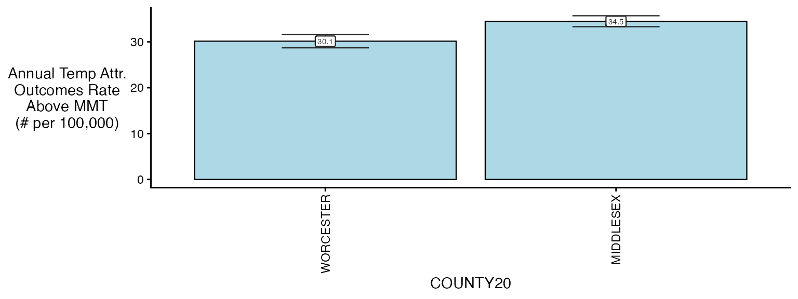
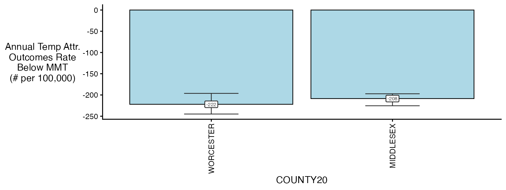
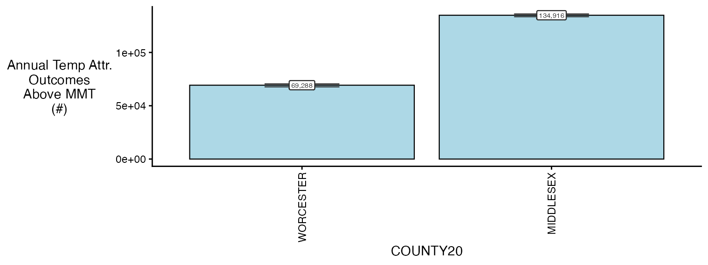
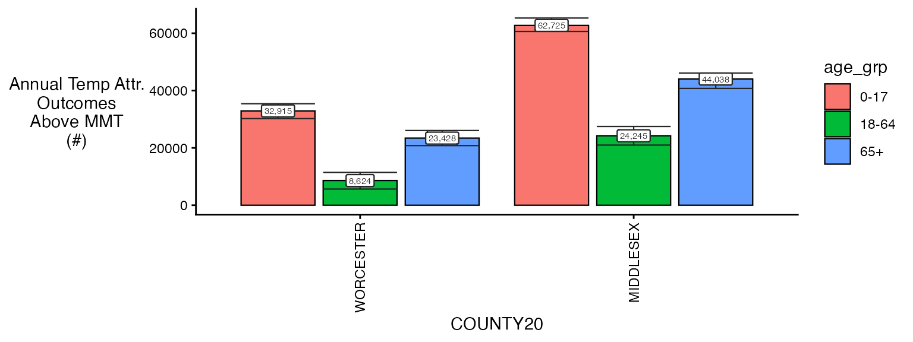
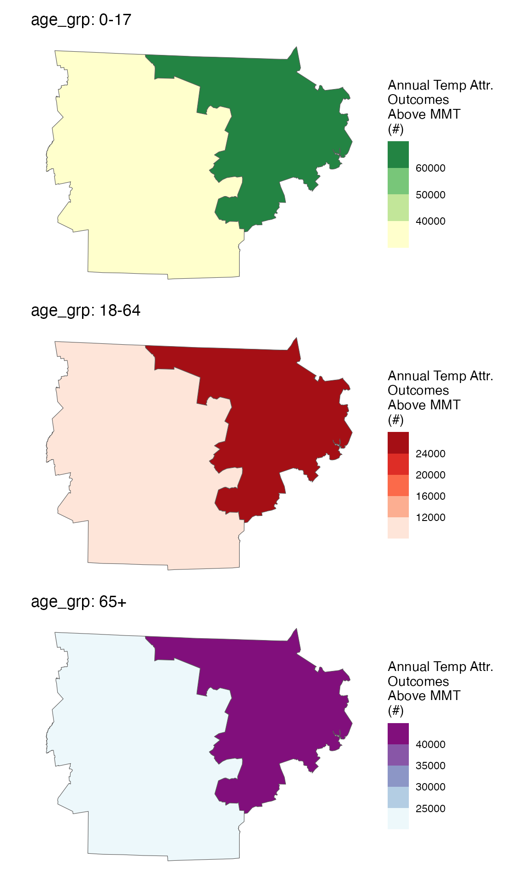

# Calculating attributable numbers and rates in \`cityHeatHealth\`

``` r

library(cityHeatHealth)
```

Estimating Attributable numbers (and rates of attributable numbers) are
a key way that we can translate relative risks into numbers that are
more tangible in public health settings. Below we provide easy
functionality to go from our model objects to estimates of attributable
numbers and rates.

### Setup

The first step of calculating attributable numbers is having a
population data estimate.

This varies a lot by place and dataset, so we don’t include
functionality for it (but an example of how this could be done can be
seen in
[`vignette("get_pop_estimates")`](http://chadmilando.com/cityHeatHealth/articles/get_pop_estimates.md)).

Assume you are starting with a dataset for the entire timeframe that
looks like this:

``` r

library(data.table)
data("ma_pop_data")
setDT(ma_pop_data)
ma_pop_data
#>               TOWN20 Female_0-17 Female_18-64 Female_65+ Male_0-17 Male_18-64
#>               <char>       <num>        <num>      <num>     <num>      <num>
#>   1:      BARNSTABLE        3899        15017       6014      4499      14035
#>   2:          BOURNE        1891         5751       3212      1489       5302
#>   3:        BREWSTER         634         2518       2007       833       2628
#>   4:         CHATHAM         163         1477       1759       480       1265
#>   5:          DENNIS         573         3792       3133       784       4101
#>  ---                                                                         
#> 347:   WEST BOYLSTON         619         2021       1107       604       2554
#> 348: WEST BROOKFIELD         343         1162        578       243       1002
#> 349:     WESTMINSTER         847         2371       1131       762       2028
#> 350:      WINCHENDON        1254         3318        711      1031       3134
#> 351:       WORCESTER       18779        67750      15995     21129      69365
#>      Male_65+
#>         <num>
#>   1:     5458
#>   2:     2810
#>   3:     1721
#>   4:     1463
#>   5:     2359
#>  ---         
#> 347:      790
#> 348:      495
#> 349:     1081
#> 350:      924
#> 351:    11173
```

Need to do some transformations:

- pivot longer
- variable clean

Note again, this processing will vary by application so this approach is
not prescriptive !

Pivot longer:

``` r

ma_pop_data_long <- melt(
  ma_pop_data,
  id.vars = "TOWN20",
  variable.name = "sex_age",
  value.name = "population"
)
```

Variable clean:

``` r

ma_pop_data_long$sex_age <- as.character(ma_pop_data_long$sex_age)
varnames <- strsplit(ma_pop_data_long$sex_age, "_", fixed = T)
varnames <- data.frame(do.call(rbind, varnames))
names(varnames) <- c('sex', 'age_grp')
rr <- which(varnames$sex == 'Female')
varnames$sex[rr] <- 'F'
rr <- which(varnames$sex == 'Male')
varnames$sex[rr] <- 'M'
ma_pop_data_long$sex = varnames$sex
ma_pop_data_long$age_grp = varnames$age_grp
ma_pop_data_long$sex_age <- NULL
ma_pop_data_long
#>                TOWN20 population    sex age_grp
#>                <char>      <num> <char>  <char>
#>    1:      BARNSTABLE       3899      F    0-17
#>    2:          BOURNE       1891      F    0-17
#>    3:        BREWSTER        634      F    0-17
#>    4:         CHATHAM        163      F    0-17
#>    5:          DENNIS        573      F    0-17
#>   ---                                          
#> 2102:   WEST BOYLSTON        790      M     65+
#> 2103: WEST BROOKFIELD        495      M     65+
#> 2104:     WESTMINSTER       1081      M     65+
#> 2105:      WINCHENDON        924      M     65+
#> 2106:       WORCESTER      11173      M     65+
```

We assume that these properties hold for the entire timeframe of our
analysis, but you could also make a version of this dataset with a
‘year’ column.

Now, quickly get a
[`condPois_1stage()`](http://chadmilando.com/cityHeatHealth/reference/condPois_1stage.md)
and
[`condPois_2stage()`](http://chadmilando.com/cityHeatHealth/reference/condPois_2stage.md)
objects to use in testing: exposures

``` r

library(data.table)
exposure_columns <- list(
  "date" = "date",
  "exposure" = "tmax_C",
  "geo_unit" = "TOWN20",
  "geo_unit_grp" = "COUNTY20"
)

ma_exposure_matrix <- make_exposure_matrix(
  subset(ma_exposure, COUNTY20 %in% c('MIDDLESEX', 'WORCESTER') &
           year(date) %in% 2012:2015), 
  exposure_columns)
#> Warning in make_exposure_matrix(subset(ma_exposure, COUNTY20 %in% c("MIDDLESEX", : check about any NA, some corrections for this later,
#>             but only in certain columns
```

outcomes

``` r

outcome_columns <- list(
  "date" = "date",
  "outcome" = "daily_deaths",
  "factor" = 'age_grp',
  "factor" = 'sex',
  "geo_unit" = "TOWN20",
  "geo_unit_grp" = "COUNTY20"
)

ma_outcomes_tbl <- make_outcome_table(
  subset(ma_deaths,COUNTY20 %in% c('MIDDLESEX', 'WORCESTER') &
           year(date) %in% 2012:2015), outcome_columns)
```

models

``` r

ma_model <- condPois_2stage(ma_exposure_matrix, ma_outcomes_tbl, verbose = 1, global_cen = 20)
#> -- validation passed
#> -- stage 1
#> -- mixmeta
#> -- stage 2
```

### Estimating the AN

Ok so now you pass in `population`.

So now estimate the AN as a full object

Remember that this needs to be compatible for:

- single zone

- ma model with ma_model\$`_`

- ma model with factor ma_model\$`0-17` \> I think you can handle this
  the same way you did before, with recursion

Now in this second step, you can choose the aggregation level that you
want results to.

In this block you need:

- what spatial resolution are you summarizing to: -\>\> ‘geo_unit’,
  ‘geo_unit_grp’, or ‘all’

- are you just getting the impacts that are \> then the centering point:
  -\>\> lets just assume yes for now, can always go back and change it

``` r

ma_AN <- calc_AN(ma_model, ma_outcomes_tbl, ma_pop_data_long,
                 spatial_agg_type = 'TOWN20', 
                 spatial_join_col = 'TOWN20', 
                 nsim = 100,
                 verbose = 2)
#> -- validation passed
#> -- estimate in each geo_unit
#> 5    10  15  20  25  30  35  40  45  50  55  60  65  70  75  80  85  90  95  100     105     110     
#> -- summarize by simulation
#> 5    10  15  20  25  30  35  40  45  50  55  60  65  70  75  80  85  90  95  100     
ma_AN$`_`$rate_table
#>          TOWN20  COUNTY20 population above_MMT mean_annual_attr_rate_est
#>          <char>    <char>      <num>    <lgcl>                     <num>
#>   1:      ACTON MIDDLESEX      23864      TRUE                 3514.7083
#>   2:      ACTON MIDDLESEX      23864     FALSE                 -213.7110
#>   3:  ARLINGTON MIDDLESEX      45906      TRUE                 3563.2597
#>   4:  ARLINGTON MIDDLESEX      45906     FALSE                 -245.8829
#>   5: ASHBURNHAM WORCESTER       6337      TRUE                 2426.2269
#>  ---                                                                    
#> 224: WINCHESTER MIDDLESEX      22809     FALSE                 -310.1846
#> 225:     WOBURN MIDDLESEX      40992      TRUE                 3370.1698
#> 226:     WOBURN MIDDLESEX      40992     FALSE                 -161.6169
#> 227:  WORCESTER WORCESTER     204191      TRUE                 3107.4460
#> 228:  WORCESTER WORCESTER     204191     FALSE                 -268.1925
#>      mean_annual_attr_rate_lb mean_annual_attr_rate_ub
#>                         <num>                    <num>
#>   1:                2774.7339               4245.69959
#>   2:                -333.7663               -108.34835
#>   3:                2801.4720               4172.54825
#>   4:                -335.8902               -159.08868
#>   5:                1739.4864               3013.55136
#>  ---                                                  
#> 224:                -418.7492               -211.48450
#> 225:                2925.1439               3908.07963
#> 226:                -234.2225                -76.14291
#> 227:                2674.7567               3591.48420
#> 228:                -380.2537               -179.29598
ma_AN$`_`$number_table
#>          TOWN20  COUNTY20 population above_MMT mean_annual_attr_num_est
#>          <char>    <char>      <num>    <lgcl>                    <num>
#>   1:      ACTON MIDDLESEX      23864      TRUE                  838.750
#>   2:      ACTON MIDDLESEX      23864     FALSE                  -51.000
#>   3:  ARLINGTON MIDDLESEX      45906      TRUE                 1635.750
#>   4:  ARLINGTON MIDDLESEX      45906     FALSE                 -112.875
#>   5: ASHBURNHAM WORCESTER       6337      TRUE                  153.750
#>  ---                                                                   
#> 224: WINCHESTER MIDDLESEX      22809     FALSE                  -70.750
#> 225:     WOBURN MIDDLESEX      40992      TRUE                 1381.500
#> 226:     WOBURN MIDDLESEX      40992     FALSE                  -66.250
#> 227:  WORCESTER WORCESTER     204191      TRUE                 6345.125
#> 228:  WORCESTER WORCESTER     204191     FALSE                 -547.625
#>      mean_annual_attr_num_lb mean_annual_attr_num_ub
#>                        <num>                   <num>
#>   1:                662.1625              1013.19375
#>   2:                -79.6500               -25.85625
#>   3:               1286.0438              1915.45000
#>   4:               -154.1938               -73.03125
#>   5:                110.2313               190.96875
#>  ---                                                
#> 224:                -95.5125               -48.23750
#> 225:               1199.0750              1602.00000
#> 226:                -96.0125               -31.21250
#> 227:               5461.6125              7333.48750
#> 228:               -776.4437              -366.10625
```

you can change `spatial_agg_type` to be a different spatial resolution – either
whatever the group variable was or “all”

``` r

ma_AN <- calc_AN(ma_model, ma_outcomes_tbl, ma_pop_data_long,
                 spatial_agg_type = 'COUNTY20', 
                 spatial_join_col = 'TOWN20', 
                 nsim = 100,
                 verbose = 2)
#> -- validation passed
#> -- estimate in each geo_unit
#> 5    10  15  20  25  30  35  40  45  50  55  60  65  70  75  80  85  90  95  100     105     110     
#> -- summarize by simulation
#> 5    10  15  20  25  30  35  40  45  50  55  60  65  70  75  80  85  90  95  100     
ma_AN$`_`$rate_table
#>     COUNTY20 population above_MMT mean_annual_attr_rate_est
#>       <char>      <num>    <lgcl>                     <num>
#> 1: MIDDLESEX    1623109      TRUE                 3447.9046
#> 2: MIDDLESEX    1623109     FALSE                 -208.5042
#> 3: WORCESTER     858898      TRUE                 3014.6187
#> 4: WORCESTER     858898     FALSE                 -221.9414
#>    mean_annual_attr_rate_lb mean_annual_attr_rate_ub
#>                       <num>                    <num>
#> 1:                3330.5118                3568.8403
#> 2:                -225.4081                -197.1714
#> 3:                2869.3694                3162.1675
#> 4:                -244.8792                -196.2311
ma_AN$`_`$number_table
#>     COUNTY20 population above_MMT mean_annual_attr_num_est
#>       <char>      <num>    <lgcl>                    <num>
#> 1: MIDDLESEX    1623109      TRUE                 55963.25
#> 2: MIDDLESEX    1623109     FALSE                 -3384.25
#> 3: WORCESTER     858898      TRUE                 25892.50
#> 4: WORCESTER     858898     FALSE                 -1906.25
#>    mean_annual_attr_num_lb mean_annual_attr_num_ub
#>                      <num>                   <num>
#> 1:               54057.837               57926.169
#> 2:               -3658.619               -3200.306
#> 3:               24644.956               27159.794
#> 4:               -2103.262               -1685.425
```

See that the numbers are roughly the same for Suffolk county ? They
won’t be exactly the same because of how the averaging works.

Some plot functions exist:

``` r

plot(ma_AN, table_type = 'rate', above_MMT = T)
```



``` r

plot(ma_AN, table_type = 'rate', above_MMT = F)
```



### Estimating the AN - single

check of single

``` r


# run the model
m2 <- condPois_1stage(exposure_matrix = ma_exposure_matrix, 
                  outcomes_tbl = ma_outcomes_tbl, 
                  multi_zone = TRUE)
#> Warning in condPois_1stage(exposure_matrix = ma_exposure_matrix, outcomes_tbl =
#> ma_outcomes_tbl, : Centering point is outside the range of exposures in
#> geo-unit ACTON. This means your zones are across too large of an area, or there
#> are differences in exposures so much that the bases are quite different. Try
#> limiting the geo-units passed in to those that are more similar, manually
#> setting a centering point that you know each geo-unit has, or changing your
#> exposure variable.
#> Warning in condPois_1stage(exposure_matrix = ma_exposure_matrix, outcomes_tbl =
#> ma_outcomes_tbl, : Centering point is outside the range of exposures in
#> geo-unit ARLINGTON. This means your zones are across too large of an area, or
#> there are differences in exposures so much that the bases are quite different.
#> Try limiting the geo-units passed in to those that are more similar, manually
#> setting a centering point that you know each geo-unit has, or changing your
#> exposure variable.
#> Warning in condPois_1stage(exposure_matrix = ma_exposure_matrix, outcomes_tbl =
#> ma_outcomes_tbl, : Centering point is outside the range of exposures in
#> geo-unit ASHBURNHAM. This means your zones are across too large of an area, or
#> there are differences in exposures so much that the bases are quite different.
#> Try limiting the geo-units passed in to those that are more similar, manually
#> setting a centering point that you know each geo-unit has, or changing your
#> exposure variable.
#> Warning in condPois_1stage(exposure_matrix = ma_exposure_matrix, outcomes_tbl =
#> ma_outcomes_tbl, : Centering point is outside the range of exposures in
#> geo-unit ASHBY. This means your zones are across too large of an area, or there
#> are differences in exposures so much that the bases are quite different. Try
#> limiting the geo-units passed in to those that are more similar, manually
#> setting a centering point that you know each geo-unit has, or changing your
#> exposure variable.
#> Warning in condPois_1stage(exposure_matrix = ma_exposure_matrix, outcomes_tbl =
#> ma_outcomes_tbl, : Centering point is outside the range of exposures in
#> geo-unit ASHLAND. This means your zones are across too large of an area, or
#> there are differences in exposures so much that the bases are quite different.
#> Try limiting the geo-units passed in to those that are more similar, manually
#> setting a centering point that you know each geo-unit has, or changing your
#> exposure variable.
#> Warning in condPois_1stage(exposure_matrix = ma_exposure_matrix, outcomes_tbl =
#> ma_outcomes_tbl, : Centering point is outside the range of exposures in
#> geo-unit ATHOL. This means your zones are across too large of an area, or there
#> are differences in exposures so much that the bases are quite different. Try
#> limiting the geo-units passed in to those that are more similar, manually
#> setting a centering point that you know each geo-unit has, or changing your
#> exposure variable.
#> Warning in condPois_1stage(exposure_matrix = ma_exposure_matrix, outcomes_tbl =
#> ma_outcomes_tbl, : Centering point is outside the range of exposures in
#> geo-unit AUBURN. This means your zones are across too large of an area, or
#> there are differences in exposures so much that the bases are quite different.
#> Try limiting the geo-units passed in to those that are more similar, manually
#> setting a centering point that you know each geo-unit has, or changing your
#> exposure variable.
#> Warning in condPois_1stage(exposure_matrix = ma_exposure_matrix, outcomes_tbl =
#> ma_outcomes_tbl, : Centering point is outside the range of exposures in
#> geo-unit AYER. This means your zones are across too large of an area, or there
#> are differences in exposures so much that the bases are quite different. Try
#> limiting the geo-units passed in to those that are more similar, manually
#> setting a centering point that you know each geo-unit has, or changing your
#> exposure variable.
#> Warning in condPois_1stage(exposure_matrix = ma_exposure_matrix, outcomes_tbl =
#> ma_outcomes_tbl, : Centering point is outside the range of exposures in
#> geo-unit BARRE. This means your zones are across too large of an area, or there
#> are differences in exposures so much that the bases are quite different. Try
#> limiting the geo-units passed in to those that are more similar, manually
#> setting a centering point that you know each geo-unit has, or changing your
#> exposure variable.
#> Warning in condPois_1stage(exposure_matrix = ma_exposure_matrix, outcomes_tbl =
#> ma_outcomes_tbl, : Centering point is outside the range of exposures in
#> geo-unit BEDFORD. This means your zones are across too large of an area, or
#> there are differences in exposures so much that the bases are quite different.
#> Try limiting the geo-units passed in to those that are more similar, manually
#> setting a centering point that you know each geo-unit has, or changing your
#> exposure variable.
#> Warning in condPois_1stage(exposure_matrix = ma_exposure_matrix, outcomes_tbl =
#> ma_outcomes_tbl, : Centering point is outside the range of exposures in
#> geo-unit BELMONT. This means your zones are across too large of an area, or
#> there are differences in exposures so much that the bases are quite different.
#> Try limiting the geo-units passed in to those that are more similar, manually
#> setting a centering point that you know each geo-unit has, or changing your
#> exposure variable.
#> Warning in condPois_1stage(exposure_matrix = ma_exposure_matrix, outcomes_tbl =
#> ma_outcomes_tbl, : Centering point is outside the range of exposures in
#> geo-unit BERLIN. This means your zones are across too large of an area, or
#> there are differences in exposures so much that the bases are quite different.
#> Try limiting the geo-units passed in to those that are more similar, manually
#> setting a centering point that you know each geo-unit has, or changing your
#> exposure variable.
#> Warning in condPois_1stage(exposure_matrix = ma_exposure_matrix, outcomes_tbl =
#> ma_outcomes_tbl, : Centering point is outside the range of exposures in
#> geo-unit BILLERICA. This means your zones are across too large of an area, or
#> there are differences in exposures so much that the bases are quite different.
#> Try limiting the geo-units passed in to those that are more similar, manually
#> setting a centering point that you know each geo-unit has, or changing your
#> exposure variable.
#> Warning in condPois_1stage(exposure_matrix = ma_exposure_matrix, outcomes_tbl =
#> ma_outcomes_tbl, : Centering point is outside the range of exposures in
#> geo-unit BLACKSTONE. This means your zones are across too large of an area, or
#> there are differences in exposures so much that the bases are quite different.
#> Try limiting the geo-units passed in to those that are more similar, manually
#> setting a centering point that you know each geo-unit has, or changing your
#> exposure variable.
#> Warning in condPois_1stage(exposure_matrix = ma_exposure_matrix, outcomes_tbl =
#> ma_outcomes_tbl, : Centering point is outside the range of exposures in
#> geo-unit BOLTON. This means your zones are across too large of an area, or
#> there are differences in exposures so much that the bases are quite different.
#> Try limiting the geo-units passed in to those that are more similar, manually
#> setting a centering point that you know each geo-unit has, or changing your
#> exposure variable.
#> Warning in condPois_1stage(exposure_matrix = ma_exposure_matrix, outcomes_tbl =
#> ma_outcomes_tbl, : Centering point is outside the range of exposures in
#> geo-unit BOXBOROUGH. This means your zones are across too large of an area, or
#> there are differences in exposures so much that the bases are quite different.
#> Try limiting the geo-units passed in to those that are more similar, manually
#> setting a centering point that you know each geo-unit has, or changing your
#> exposure variable.
#> Warning in condPois_1stage(exposure_matrix = ma_exposure_matrix, outcomes_tbl =
#> ma_outcomes_tbl, : Centering point is outside the range of exposures in
#> geo-unit BOYLSTON. This means your zones are across too large of an area, or
#> there are differences in exposures so much that the bases are quite different.
#> Try limiting the geo-units passed in to those that are more similar, manually
#> setting a centering point that you know each geo-unit has, or changing your
#> exposure variable.
#> Warning in condPois_1stage(exposure_matrix = ma_exposure_matrix, outcomes_tbl =
#> ma_outcomes_tbl, : Centering point is outside the range of exposures in
#> geo-unit BROOKFIELD. This means your zones are across too large of an area, or
#> there are differences in exposures so much that the bases are quite different.
#> Try limiting the geo-units passed in to those that are more similar, manually
#> setting a centering point that you know each geo-unit has, or changing your
#> exposure variable.
#> Warning in condPois_1stage(exposure_matrix = ma_exposure_matrix, outcomes_tbl =
#> ma_outcomes_tbl, : Centering point is outside the range of exposures in
#> geo-unit BURLINGTON. This means your zones are across too large of an area, or
#> there are differences in exposures so much that the bases are quite different.
#> Try limiting the geo-units passed in to those that are more similar, manually
#> setting a centering point that you know each geo-unit has, or changing your
#> exposure variable.
#> Warning in condPois_1stage(exposure_matrix = ma_exposure_matrix, outcomes_tbl =
#> ma_outcomes_tbl, : Centering point is outside the range of exposures in
#> geo-unit CAMBRIDGE. This means your zones are across too large of an area, or
#> there are differences in exposures so much that the bases are quite different.
#> Try limiting the geo-units passed in to those that are more similar, manually
#> setting a centering point that you know each geo-unit has, or changing your
#> exposure variable.
#> Warning in condPois_1stage(exposure_matrix = ma_exposure_matrix, outcomes_tbl =
#> ma_outcomes_tbl, : Centering point is outside the range of exposures in
#> geo-unit CARLISLE. This means your zones are across too large of an area, or
#> there are differences in exposures so much that the bases are quite different.
#> Try limiting the geo-units passed in to those that are more similar, manually
#> setting a centering point that you know each geo-unit has, or changing your
#> exposure variable.
#> Warning in condPois_1stage(exposure_matrix = ma_exposure_matrix, outcomes_tbl =
#> ma_outcomes_tbl, : Centering point is outside the range of exposures in
#> geo-unit CHARLTON. This means your zones are across too large of an area, or
#> there are differences in exposures so much that the bases are quite different.
#> Try limiting the geo-units passed in to those that are more similar, manually
#> setting a centering point that you know each geo-unit has, or changing your
#> exposure variable.
#> Warning in condPois_1stage(exposure_matrix = ma_exposure_matrix, outcomes_tbl =
#> ma_outcomes_tbl, : Centering point is outside the range of exposures in
#> geo-unit CHELMSFORD. This means your zones are across too large of an area, or
#> there are differences in exposures so much that the bases are quite different.
#> Try limiting the geo-units passed in to those that are more similar, manually
#> setting a centering point that you know each geo-unit has, or changing your
#> exposure variable.
#> Warning in condPois_1stage(exposure_matrix = ma_exposure_matrix, outcomes_tbl =
#> ma_outcomes_tbl, : Centering point is outside the range of exposures in
#> geo-unit CLINTON. This means your zones are across too large of an area, or
#> there are differences in exposures so much that the bases are quite different.
#> Try limiting the geo-units passed in to those that are more similar, manually
#> setting a centering point that you know each geo-unit has, or changing your
#> exposure variable.
#> Warning in condPois_1stage(exposure_matrix = ma_exposure_matrix, outcomes_tbl =
#> ma_outcomes_tbl, : Centering point is outside the range of exposures in
#> geo-unit CONCORD. This means your zones are across too large of an area, or
#> there are differences in exposures so much that the bases are quite different.
#> Try limiting the geo-units passed in to those that are more similar, manually
#> setting a centering point that you know each geo-unit has, or changing your
#> exposure variable.
#> Warning in condPois_1stage(exposure_matrix = ma_exposure_matrix, outcomes_tbl =
#> ma_outcomes_tbl, : Centering point is outside the range of exposures in
#> geo-unit DOUGLAS. This means your zones are across too large of an area, or
#> there are differences in exposures so much that the bases are quite different.
#> Try limiting the geo-units passed in to those that are more similar, manually
#> setting a centering point that you know each geo-unit has, or changing your
#> exposure variable.
#> Warning in condPois_1stage(exposure_matrix = ma_exposure_matrix, outcomes_tbl =
#> ma_outcomes_tbl, : Centering point is outside the range of exposures in
#> geo-unit DRACUT. This means your zones are across too large of an area, or
#> there are differences in exposures so much that the bases are quite different.
#> Try limiting the geo-units passed in to those that are more similar, manually
#> setting a centering point that you know each geo-unit has, or changing your
#> exposure variable.
#> Warning in condPois_1stage(exposure_matrix = ma_exposure_matrix, outcomes_tbl =
#> ma_outcomes_tbl, : Centering point is outside the range of exposures in
#> geo-unit DUDLEY. This means your zones are across too large of an area, or
#> there are differences in exposures so much that the bases are quite different.
#> Try limiting the geo-units passed in to those that are more similar, manually
#> setting a centering point that you know each geo-unit has, or changing your
#> exposure variable.
#> Warning in condPois_1stage(exposure_matrix = ma_exposure_matrix, outcomes_tbl =
#> ma_outcomes_tbl, : Centering point is outside the range of exposures in
#> geo-unit DUNSTABLE. This means your zones are across too large of an area, or
#> there are differences in exposures so much that the bases are quite different.
#> Try limiting the geo-units passed in to those that are more similar, manually
#> setting a centering point that you know each geo-unit has, or changing your
#> exposure variable.
#> Warning in condPois_1stage(exposure_matrix = ma_exposure_matrix, outcomes_tbl =
#> ma_outcomes_tbl, : Centering point is outside the range of exposures in
#> geo-unit EAST BROOKFIELD. This means your zones are across too large of an
#> area, or there are differences in exposures so much that the bases are quite
#> different. Try limiting the geo-units passed in to those that are more similar,
#> manually setting a centering point that you know each geo-unit has, or changing
#> your exposure variable.
#> Warning in condPois_1stage(exposure_matrix = ma_exposure_matrix, outcomes_tbl =
#> ma_outcomes_tbl, : Centering point is outside the range of exposures in
#> geo-unit EVERETT. This means your zones are across too large of an area, or
#> there are differences in exposures so much that the bases are quite different.
#> Try limiting the geo-units passed in to those that are more similar, manually
#> setting a centering point that you know each geo-unit has, or changing your
#> exposure variable.
#> Warning in condPois_1stage(exposure_matrix = ma_exposure_matrix, outcomes_tbl =
#> ma_outcomes_tbl, : Centering point is outside the range of exposures in
#> geo-unit FITCHBURG. This means your zones are across too large of an area, or
#> there are differences in exposures so much that the bases are quite different.
#> Try limiting the geo-units passed in to those that are more similar, manually
#> setting a centering point that you know each geo-unit has, or changing your
#> exposure variable.
#> Warning in condPois_1stage(exposure_matrix = ma_exposure_matrix, outcomes_tbl =
#> ma_outcomes_tbl, : Centering point is outside the range of exposures in
#> geo-unit FRAMINGHAM. This means your zones are across too large of an area, or
#> there are differences in exposures so much that the bases are quite different.
#> Try limiting the geo-units passed in to those that are more similar, manually
#> setting a centering point that you know each geo-unit has, or changing your
#> exposure variable.
#> Warning in condPois_1stage(exposure_matrix = ma_exposure_matrix, outcomes_tbl =
#> ma_outcomes_tbl, : Centering point is outside the range of exposures in
#> geo-unit GARDNER. This means your zones are across too large of an area, or
#> there are differences in exposures so much that the bases are quite different.
#> Try limiting the geo-units passed in to those that are more similar, manually
#> setting a centering point that you know each geo-unit has, or changing your
#> exposure variable.
#> Warning in condPois_1stage(exposure_matrix = ma_exposure_matrix, outcomes_tbl =
#> ma_outcomes_tbl, : Centering point is outside the range of exposures in
#> geo-unit GRAFTON. This means your zones are across too large of an area, or
#> there are differences in exposures so much that the bases are quite different.
#> Try limiting the geo-units passed in to those that are more similar, manually
#> setting a centering point that you know each geo-unit has, or changing your
#> exposure variable.
#> Warning in condPois_1stage(exposure_matrix = ma_exposure_matrix, outcomes_tbl =
#> ma_outcomes_tbl, : Centering point is outside the range of exposures in
#> geo-unit GROTON. This means your zones are across too large of an area, or
#> there are differences in exposures so much that the bases are quite different.
#> Try limiting the geo-units passed in to those that are more similar, manually
#> setting a centering point that you know each geo-unit has, or changing your
#> exposure variable.
#> Warning in condPois_1stage(exposure_matrix = ma_exposure_matrix, outcomes_tbl =
#> ma_outcomes_tbl, : Centering point is outside the range of exposures in
#> geo-unit HARDWICK. This means your zones are across too large of an area, or
#> there are differences in exposures so much that the bases are quite different.
#> Try limiting the geo-units passed in to those that are more similar, manually
#> setting a centering point that you know each geo-unit has, or changing your
#> exposure variable.
#> Warning in condPois_1stage(exposure_matrix = ma_exposure_matrix, outcomes_tbl =
#> ma_outcomes_tbl, : Centering point is outside the range of exposures in
#> geo-unit HARVARD. This means your zones are across too large of an area, or
#> there are differences in exposures so much that the bases are quite different.
#> Try limiting the geo-units passed in to those that are more similar, manually
#> setting a centering point that you know each geo-unit has, or changing your
#> exposure variable.
#> Warning in condPois_1stage(exposure_matrix = ma_exposure_matrix, outcomes_tbl =
#> ma_outcomes_tbl, : Centering point is outside the range of exposures in
#> geo-unit HOLDEN. This means your zones are across too large of an area, or
#> there are differences in exposures so much that the bases are quite different.
#> Try limiting the geo-units passed in to those that are more similar, manually
#> setting a centering point that you know each geo-unit has, or changing your
#> exposure variable.
#> Warning in condPois_1stage(exposure_matrix = ma_exposure_matrix, outcomes_tbl =
#> ma_outcomes_tbl, : Centering point is outside the range of exposures in
#> geo-unit HOLLISTON. This means your zones are across too large of an area, or
#> there are differences in exposures so much that the bases are quite different.
#> Try limiting the geo-units passed in to those that are more similar, manually
#> setting a centering point that you know each geo-unit has, or changing your
#> exposure variable.
#> Warning in condPois_1stage(exposure_matrix = ma_exposure_matrix, outcomes_tbl =
#> ma_outcomes_tbl, : Centering point is outside the range of exposures in
#> geo-unit HOPEDALE. This means your zones are across too large of an area, or
#> there are differences in exposures so much that the bases are quite different.
#> Try limiting the geo-units passed in to those that are more similar, manually
#> setting a centering point that you know each geo-unit has, or changing your
#> exposure variable.
#> Warning in condPois_1stage(exposure_matrix = ma_exposure_matrix, outcomes_tbl =
#> ma_outcomes_tbl, : Centering point is outside the range of exposures in
#> geo-unit HOPKINTON. This means your zones are across too large of an area, or
#> there are differences in exposures so much that the bases are quite different.
#> Try limiting the geo-units passed in to those that are more similar, manually
#> setting a centering point that you know each geo-unit has, or changing your
#> exposure variable.
#> Warning in condPois_1stage(exposure_matrix = ma_exposure_matrix, outcomes_tbl =
#> ma_outcomes_tbl, : Centering point is outside the range of exposures in
#> geo-unit HUBBARDSTON. This means your zones are across too large of an area, or
#> there are differences in exposures so much that the bases are quite different.
#> Try limiting the geo-units passed in to those that are more similar, manually
#> setting a centering point that you know each geo-unit has, or changing your
#> exposure variable.
#> Warning in condPois_1stage(exposure_matrix = ma_exposure_matrix, outcomes_tbl =
#> ma_outcomes_tbl, : Centering point is outside the range of exposures in
#> geo-unit HUDSON. This means your zones are across too large of an area, or
#> there are differences in exposures so much that the bases are quite different.
#> Try limiting the geo-units passed in to those that are more similar, manually
#> setting a centering point that you know each geo-unit has, or changing your
#> exposure variable.
#> Warning in condPois_1stage(exposure_matrix = ma_exposure_matrix, outcomes_tbl =
#> ma_outcomes_tbl, : Centering point is outside the range of exposures in
#> geo-unit LANCASTER. This means your zones are across too large of an area, or
#> there are differences in exposures so much that the bases are quite different.
#> Try limiting the geo-units passed in to those that are more similar, manually
#> setting a centering point that you know each geo-unit has, or changing your
#> exposure variable.
#> Warning in condPois_1stage(exposure_matrix = ma_exposure_matrix, outcomes_tbl =
#> ma_outcomes_tbl, : Centering point is outside the range of exposures in
#> geo-unit LEICESTER. This means your zones are across too large of an area, or
#> there are differences in exposures so much that the bases are quite different.
#> Try limiting the geo-units passed in to those that are more similar, manually
#> setting a centering point that you know each geo-unit has, or changing your
#> exposure variable.
#> Warning in condPois_1stage(exposure_matrix = ma_exposure_matrix, outcomes_tbl =
#> ma_outcomes_tbl, : Centering point is outside the range of exposures in
#> geo-unit LEOMINSTER. This means your zones are across too large of an area, or
#> there are differences in exposures so much that the bases are quite different.
#> Try limiting the geo-units passed in to those that are more similar, manually
#> setting a centering point that you know each geo-unit has, or changing your
#> exposure variable.
#> Warning in condPois_1stage(exposure_matrix = ma_exposure_matrix, outcomes_tbl =
#> ma_outcomes_tbl, : Centering point is outside the range of exposures in
#> geo-unit LEXINGTON. This means your zones are across too large of an area, or
#> there are differences in exposures so much that the bases are quite different.
#> Try limiting the geo-units passed in to those that are more similar, manually
#> setting a centering point that you know each geo-unit has, or changing your
#> exposure variable.
#> Warning in condPois_1stage(exposure_matrix = ma_exposure_matrix, outcomes_tbl =
#> ma_outcomes_tbl, : Centering point is outside the range of exposures in
#> geo-unit LINCOLN. This means your zones are across too large of an area, or
#> there are differences in exposures so much that the bases are quite different.
#> Try limiting the geo-units passed in to those that are more similar, manually
#> setting a centering point that you know each geo-unit has, or changing your
#> exposure variable.
#> Warning in condPois_1stage(exposure_matrix = ma_exposure_matrix, outcomes_tbl =
#> ma_outcomes_tbl, : Centering point is outside the range of exposures in
#> geo-unit LITTLETON. This means your zones are across too large of an area, or
#> there are differences in exposures so much that the bases are quite different.
#> Try limiting the geo-units passed in to those that are more similar, manually
#> setting a centering point that you know each geo-unit has, or changing your
#> exposure variable.
#> Warning in condPois_1stage(exposure_matrix = ma_exposure_matrix, outcomes_tbl =
#> ma_outcomes_tbl, : Centering point is outside the range of exposures in
#> geo-unit LOWELL. This means your zones are across too large of an area, or
#> there are differences in exposures so much that the bases are quite different.
#> Try limiting the geo-units passed in to those that are more similar, manually
#> setting a centering point that you know each geo-unit has, or changing your
#> exposure variable.
#> Warning in condPois_1stage(exposure_matrix = ma_exposure_matrix, outcomes_tbl =
#> ma_outcomes_tbl, : Centering point is outside the range of exposures in
#> geo-unit LUNENBURG. This means your zones are across too large of an area, or
#> there are differences in exposures so much that the bases are quite different.
#> Try limiting the geo-units passed in to those that are more similar, manually
#> setting a centering point that you know each geo-unit has, or changing your
#> exposure variable.
#> Warning in condPois_1stage(exposure_matrix = ma_exposure_matrix, outcomes_tbl =
#> ma_outcomes_tbl, : Centering point is outside the range of exposures in
#> geo-unit MALDEN. This means your zones are across too large of an area, or
#> there are differences in exposures so much that the bases are quite different.
#> Try limiting the geo-units passed in to those that are more similar, manually
#> setting a centering point that you know each geo-unit has, or changing your
#> exposure variable.
#> Warning in condPois_1stage(exposure_matrix = ma_exposure_matrix, outcomes_tbl =
#> ma_outcomes_tbl, : Centering point is outside the range of exposures in
#> geo-unit MARLBOROUGH. This means your zones are across too large of an area, or
#> there are differences in exposures so much that the bases are quite different.
#> Try limiting the geo-units passed in to those that are more similar, manually
#> setting a centering point that you know each geo-unit has, or changing your
#> exposure variable.
#> Warning in condPois_1stage(exposure_matrix = ma_exposure_matrix, outcomes_tbl =
#> ma_outcomes_tbl, : Centering point is outside the range of exposures in
#> geo-unit MAYNARD. This means your zones are across too large of an area, or
#> there are differences in exposures so much that the bases are quite different.
#> Try limiting the geo-units passed in to those that are more similar, manually
#> setting a centering point that you know each geo-unit has, or changing your
#> exposure variable.
#> Warning in condPois_1stage(exposure_matrix = ma_exposure_matrix, outcomes_tbl =
#> ma_outcomes_tbl, : Centering point is outside the range of exposures in
#> geo-unit MEDFORD. This means your zones are across too large of an area, or
#> there are differences in exposures so much that the bases are quite different.
#> Try limiting the geo-units passed in to those that are more similar, manually
#> setting a centering point that you know each geo-unit has, or changing your
#> exposure variable.
#> Warning in condPois_1stage(exposure_matrix = ma_exposure_matrix, outcomes_tbl =
#> ma_outcomes_tbl, : Centering point is outside the range of exposures in
#> geo-unit MELROSE. This means your zones are across too large of an area, or
#> there are differences in exposures so much that the bases are quite different.
#> Try limiting the geo-units passed in to those that are more similar, manually
#> setting a centering point that you know each geo-unit has, or changing your
#> exposure variable.
#> Warning in condPois_1stage(exposure_matrix = ma_exposure_matrix, outcomes_tbl =
#> ma_outcomes_tbl, : Centering point is outside the range of exposures in
#> geo-unit MENDON. This means your zones are across too large of an area, or
#> there are differences in exposures so much that the bases are quite different.
#> Try limiting the geo-units passed in to those that are more similar, manually
#> setting a centering point that you know each geo-unit has, or changing your
#> exposure variable.
#> Warning in condPois_1stage(exposure_matrix = ma_exposure_matrix, outcomes_tbl =
#> ma_outcomes_tbl, : Centering point is outside the range of exposures in
#> geo-unit MILFORD. This means your zones are across too large of an area, or
#> there are differences in exposures so much that the bases are quite different.
#> Try limiting the geo-units passed in to those that are more similar, manually
#> setting a centering point that you know each geo-unit has, or changing your
#> exposure variable.
#> Warning in condPois_1stage(exposure_matrix = ma_exposure_matrix, outcomes_tbl =
#> ma_outcomes_tbl, : Centering point is outside the range of exposures in
#> geo-unit MILLBURY. This means your zones are across too large of an area, or
#> there are differences in exposures so much that the bases are quite different.
#> Try limiting the geo-units passed in to those that are more similar, manually
#> setting a centering point that you know each geo-unit has, or changing your
#> exposure variable.
#> Warning in condPois_1stage(exposure_matrix = ma_exposure_matrix, outcomes_tbl =
#> ma_outcomes_tbl, : Centering point is outside the range of exposures in
#> geo-unit MILLVILLE. This means your zones are across too large of an area, or
#> there are differences in exposures so much that the bases are quite different.
#> Try limiting the geo-units passed in to those that are more similar, manually
#> setting a centering point that you know each geo-unit has, or changing your
#> exposure variable.
#> Warning in condPois_1stage(exposure_matrix = ma_exposure_matrix, outcomes_tbl =
#> ma_outcomes_tbl, : Centering point is outside the range of exposures in
#> geo-unit NATICK. This means your zones are across too large of an area, or
#> there are differences in exposures so much that the bases are quite different.
#> Try limiting the geo-units passed in to those that are more similar, manually
#> setting a centering point that you know each geo-unit has, or changing your
#> exposure variable.
#> Warning in condPois_1stage(exposure_matrix = ma_exposure_matrix, outcomes_tbl =
#> ma_outcomes_tbl, : Centering point is outside the range of exposures in
#> geo-unit NEW BRAINTREE. This means your zones are across too large of an area,
#> or there are differences in exposures so much that the bases are quite
#> different. Try limiting the geo-units passed in to those that are more similar,
#> manually setting a centering point that you know each geo-unit has, or changing
#> your exposure variable.
#> Warning in condPois_1stage(exposure_matrix = ma_exposure_matrix, outcomes_tbl =
#> ma_outcomes_tbl, : Centering point is outside the range of exposures in
#> geo-unit NEWTON. This means your zones are across too large of an area, or
#> there are differences in exposures so much that the bases are quite different.
#> Try limiting the geo-units passed in to those that are more similar, manually
#> setting a centering point that you know each geo-unit has, or changing your
#> exposure variable.
#> Warning in condPois_1stage(exposure_matrix = ma_exposure_matrix, outcomes_tbl =
#> ma_outcomes_tbl, : Centering point is outside the range of exposures in
#> geo-unit NORTH BROOKFIELD. This means your zones are across too large of an
#> area, or there are differences in exposures so much that the bases are quite
#> different. Try limiting the geo-units passed in to those that are more similar,
#> manually setting a centering point that you know each geo-unit has, or changing
#> your exposure variable.
#> Warning in condPois_1stage(exposure_matrix = ma_exposure_matrix, outcomes_tbl =
#> ma_outcomes_tbl, : Centering point is outside the range of exposures in
#> geo-unit NORTH READING. This means your zones are across too large of an area,
#> or there are differences in exposures so much that the bases are quite
#> different. Try limiting the geo-units passed in to those that are more similar,
#> manually setting a centering point that you know each geo-unit has, or changing
#> your exposure variable.
#> Warning in condPois_1stage(exposure_matrix = ma_exposure_matrix, outcomes_tbl =
#> ma_outcomes_tbl, : Centering point is outside the range of exposures in
#> geo-unit NORTHBOROUGH. This means your zones are across too large of an area,
#> or there are differences in exposures so much that the bases are quite
#> different. Try limiting the geo-units passed in to those that are more similar,
#> manually setting a centering point that you know each geo-unit has, or changing
#> your exposure variable.
#> Warning in condPois_1stage(exposure_matrix = ma_exposure_matrix, outcomes_tbl =
#> ma_outcomes_tbl, : Centering point is outside the range of exposures in
#> geo-unit NORTHBRIDGE. This means your zones are across too large of an area, or
#> there are differences in exposures so much that the bases are quite different.
#> Try limiting the geo-units passed in to those that are more similar, manually
#> setting a centering point that you know each geo-unit has, or changing your
#> exposure variable.
#> Warning in condPois_1stage(exposure_matrix = ma_exposure_matrix, outcomes_tbl =
#> ma_outcomes_tbl, : Centering point is outside the range of exposures in
#> geo-unit OAKHAM. This means your zones are across too large of an area, or
#> there are differences in exposures so much that the bases are quite different.
#> Try limiting the geo-units passed in to those that are more similar, manually
#> setting a centering point that you know each geo-unit has, or changing your
#> exposure variable.
#> Warning in condPois_1stage(exposure_matrix = ma_exposure_matrix, outcomes_tbl =
#> ma_outcomes_tbl, : Centering point is outside the range of exposures in
#> geo-unit OXFORD. This means your zones are across too large of an area, or
#> there are differences in exposures so much that the bases are quite different.
#> Try limiting the geo-units passed in to those that are more similar, manually
#> setting a centering point that you know each geo-unit has, or changing your
#> exposure variable.
#> Warning in condPois_1stage(exposure_matrix = ma_exposure_matrix, outcomes_tbl =
#> ma_outcomes_tbl, : Centering point is outside the range of exposures in
#> geo-unit PAXTON. This means your zones are across too large of an area, or
#> there are differences in exposures so much that the bases are quite different.
#> Try limiting the geo-units passed in to those that are more similar, manually
#> setting a centering point that you know each geo-unit has, or changing your
#> exposure variable.
#> Warning in condPois_1stage(exposure_matrix = ma_exposure_matrix, outcomes_tbl =
#> ma_outcomes_tbl, : Centering point is outside the range of exposures in
#> geo-unit PEPPERELL. This means your zones are across too large of an area, or
#> there are differences in exposures so much that the bases are quite different.
#> Try limiting the geo-units passed in to those that are more similar, manually
#> setting a centering point that you know each geo-unit has, or changing your
#> exposure variable.
#> Warning in condPois_1stage(exposure_matrix = ma_exposure_matrix, outcomes_tbl =
#> ma_outcomes_tbl, : Centering point is outside the range of exposures in
#> geo-unit PETERSHAM. This means your zones are across too large of an area, or
#> there are differences in exposures so much that the bases are quite different.
#> Try limiting the geo-units passed in to those that are more similar, manually
#> setting a centering point that you know each geo-unit has, or changing your
#> exposure variable.
#> Warning in condPois_1stage(exposure_matrix = ma_exposure_matrix, outcomes_tbl =
#> ma_outcomes_tbl, : Centering point is outside the range of exposures in
#> geo-unit PHILLIPSTON. This means your zones are across too large of an area, or
#> there are differences in exposures so much that the bases are quite different.
#> Try limiting the geo-units passed in to those that are more similar, manually
#> setting a centering point that you know each geo-unit has, or changing your
#> exposure variable.
#> Warning in condPois_1stage(exposure_matrix = ma_exposure_matrix, outcomes_tbl =
#> ma_outcomes_tbl, : Centering point is outside the range of exposures in
#> geo-unit PRINCETON. This means your zones are across too large of an area, or
#> there are differences in exposures so much that the bases are quite different.
#> Try limiting the geo-units passed in to those that are more similar, manually
#> setting a centering point that you know each geo-unit has, or changing your
#> exposure variable.
#> Warning in condPois_1stage(exposure_matrix = ma_exposure_matrix, outcomes_tbl =
#> ma_outcomes_tbl, : Centering point is outside the range of exposures in
#> geo-unit READING. This means your zones are across too large of an area, or
#> there are differences in exposures so much that the bases are quite different.
#> Try limiting the geo-units passed in to those that are more similar, manually
#> setting a centering point that you know each geo-unit has, or changing your
#> exposure variable.
#> Warning in condPois_1stage(exposure_matrix = ma_exposure_matrix, outcomes_tbl =
#> ma_outcomes_tbl, : Centering point is outside the range of exposures in
#> geo-unit ROYALSTON. This means your zones are across too large of an area, or
#> there are differences in exposures so much that the bases are quite different.
#> Try limiting the geo-units passed in to those that are more similar, manually
#> setting a centering point that you know each geo-unit has, or changing your
#> exposure variable.
#> Warning in condPois_1stage(exposure_matrix = ma_exposure_matrix, outcomes_tbl =
#> ma_outcomes_tbl, : Centering point is outside the range of exposures in
#> geo-unit RUTLAND. This means your zones are across too large of an area, or
#> there are differences in exposures so much that the bases are quite different.
#> Try limiting the geo-units passed in to those that are more similar, manually
#> setting a centering point that you know each geo-unit has, or changing your
#> exposure variable.
#> Warning in condPois_1stage(exposure_matrix = ma_exposure_matrix, outcomes_tbl =
#> ma_outcomes_tbl, : Centering point is outside the range of exposures in
#> geo-unit SHERBORN. This means your zones are across too large of an area, or
#> there are differences in exposures so much that the bases are quite different.
#> Try limiting the geo-units passed in to those that are more similar, manually
#> setting a centering point that you know each geo-unit has, or changing your
#> exposure variable.
#> Warning in condPois_1stage(exposure_matrix = ma_exposure_matrix, outcomes_tbl =
#> ma_outcomes_tbl, : Centering point is outside the range of exposures in
#> geo-unit SHIRLEY. This means your zones are across too large of an area, or
#> there are differences in exposures so much that the bases are quite different.
#> Try limiting the geo-units passed in to those that are more similar, manually
#> setting a centering point that you know each geo-unit has, or changing your
#> exposure variable.
#> Warning in condPois_1stage(exposure_matrix = ma_exposure_matrix, outcomes_tbl =
#> ma_outcomes_tbl, : Centering point is outside the range of exposures in
#> geo-unit SHREWSBURY. This means your zones are across too large of an area, or
#> there are differences in exposures so much that the bases are quite different.
#> Try limiting the geo-units passed in to those that are more similar, manually
#> setting a centering point that you know each geo-unit has, or changing your
#> exposure variable.
#> Warning in condPois_1stage(exposure_matrix = ma_exposure_matrix, outcomes_tbl =
#> ma_outcomes_tbl, : Centering point is outside the range of exposures in
#> geo-unit SOMERVILLE. This means your zones are across too large of an area, or
#> there are differences in exposures so much that the bases are quite different.
#> Try limiting the geo-units passed in to those that are more similar, manually
#> setting a centering point that you know each geo-unit has, or changing your
#> exposure variable.
#> Warning in condPois_1stage(exposure_matrix = ma_exposure_matrix, outcomes_tbl =
#> ma_outcomes_tbl, : Centering point is outside the range of exposures in
#> geo-unit SOUTHBOROUGH. This means your zones are across too large of an area,
#> or there are differences in exposures so much that the bases are quite
#> different. Try limiting the geo-units passed in to those that are more similar,
#> manually setting a centering point that you know each geo-unit has, or changing
#> your exposure variable.
#> Warning in condPois_1stage(exposure_matrix = ma_exposure_matrix, outcomes_tbl =
#> ma_outcomes_tbl, : Centering point is outside the range of exposures in
#> geo-unit SOUTHBRIDGE. This means your zones are across too large of an area, or
#> there are differences in exposures so much that the bases are quite different.
#> Try limiting the geo-units passed in to those that are more similar, manually
#> setting a centering point that you know each geo-unit has, or changing your
#> exposure variable.
#> Warning in condPois_1stage(exposure_matrix = ma_exposure_matrix, outcomes_tbl =
#> ma_outcomes_tbl, : Centering point is outside the range of exposures in
#> geo-unit SPENCER. This means your zones are across too large of an area, or
#> there are differences in exposures so much that the bases are quite different.
#> Try limiting the geo-units passed in to those that are more similar, manually
#> setting a centering point that you know each geo-unit has, or changing your
#> exposure variable.
#> Warning in condPois_1stage(exposure_matrix = ma_exposure_matrix, outcomes_tbl =
#> ma_outcomes_tbl, : Centering point is outside the range of exposures in
#> geo-unit STERLING. This means your zones are across too large of an area, or
#> there are differences in exposures so much that the bases are quite different.
#> Try limiting the geo-units passed in to those that are more similar, manually
#> setting a centering point that you know each geo-unit has, or changing your
#> exposure variable.
#> Warning in condPois_1stage(exposure_matrix = ma_exposure_matrix, outcomes_tbl =
#> ma_outcomes_tbl, : Centering point is outside the range of exposures in
#> geo-unit STONEHAM. This means your zones are across too large of an area, or
#> there are differences in exposures so much that the bases are quite different.
#> Try limiting the geo-units passed in to those that are more similar, manually
#> setting a centering point that you know each geo-unit has, or changing your
#> exposure variable.
#> Warning in condPois_1stage(exposure_matrix = ma_exposure_matrix, outcomes_tbl =
#> ma_outcomes_tbl, : Centering point is outside the range of exposures in
#> geo-unit STOW. This means your zones are across too large of an area, or there
#> are differences in exposures so much that the bases are quite different. Try
#> limiting the geo-units passed in to those that are more similar, manually
#> setting a centering point that you know each geo-unit has, or changing your
#> exposure variable.
#> Warning in condPois_1stage(exposure_matrix = ma_exposure_matrix, outcomes_tbl =
#> ma_outcomes_tbl, : Centering point is outside the range of exposures in
#> geo-unit STURBRIDGE. This means your zones are across too large of an area, or
#> there are differences in exposures so much that the bases are quite different.
#> Try limiting the geo-units passed in to those that are more similar, manually
#> setting a centering point that you know each geo-unit has, or changing your
#> exposure variable.
#> Warning in condPois_1stage(exposure_matrix = ma_exposure_matrix, outcomes_tbl =
#> ma_outcomes_tbl, : Centering point is outside the range of exposures in
#> geo-unit SUDBURY. This means your zones are across too large of an area, or
#> there are differences in exposures so much that the bases are quite different.
#> Try limiting the geo-units passed in to those that are more similar, manually
#> setting a centering point that you know each geo-unit has, or changing your
#> exposure variable.
#> Warning in condPois_1stage(exposure_matrix = ma_exposure_matrix, outcomes_tbl =
#> ma_outcomes_tbl, : Centering point is outside the range of exposures in
#> geo-unit SUTTON. This means your zones are across too large of an area, or
#> there are differences in exposures so much that the bases are quite different.
#> Try limiting the geo-units passed in to those that are more similar, manually
#> setting a centering point that you know each geo-unit has, or changing your
#> exposure variable.
#> Warning in condPois_1stage(exposure_matrix = ma_exposure_matrix, outcomes_tbl =
#> ma_outcomes_tbl, : Centering point is outside the range of exposures in
#> geo-unit TEMPLETON. This means your zones are across too large of an area, or
#> there are differences in exposures so much that the bases are quite different.
#> Try limiting the geo-units passed in to those that are more similar, manually
#> setting a centering point that you know each geo-unit has, or changing your
#> exposure variable.
#> Warning in condPois_1stage(exposure_matrix = ma_exposure_matrix, outcomes_tbl =
#> ma_outcomes_tbl, : Centering point is outside the range of exposures in
#> geo-unit TEWKSBURY. This means your zones are across too large of an area, or
#> there are differences in exposures so much that the bases are quite different.
#> Try limiting the geo-units passed in to those that are more similar, manually
#> setting a centering point that you know each geo-unit has, or changing your
#> exposure variable.
#> Warning in condPois_1stage(exposure_matrix = ma_exposure_matrix, outcomes_tbl =
#> ma_outcomes_tbl, : Centering point is outside the range of exposures in
#> geo-unit TOWNSEND. This means your zones are across too large of an area, or
#> there are differences in exposures so much that the bases are quite different.
#> Try limiting the geo-units passed in to those that are more similar, manually
#> setting a centering point that you know each geo-unit has, or changing your
#> exposure variable.
#> Warning in condPois_1stage(exposure_matrix = ma_exposure_matrix, outcomes_tbl =
#> ma_outcomes_tbl, : Centering point is outside the range of exposures in
#> geo-unit TYNGSBOROUGH. This means your zones are across too large of an area,
#> or there are differences in exposures so much that the bases are quite
#> different. Try limiting the geo-units passed in to those that are more similar,
#> manually setting a centering point that you know each geo-unit has, or changing
#> your exposure variable.
#> Warning in condPois_1stage(exposure_matrix = ma_exposure_matrix, outcomes_tbl =
#> ma_outcomes_tbl, : Centering point is outside the range of exposures in
#> geo-unit UPTON. This means your zones are across too large of an area, or there
#> are differences in exposures so much that the bases are quite different. Try
#> limiting the geo-units passed in to those that are more similar, manually
#> setting a centering point that you know each geo-unit has, or changing your
#> exposure variable.
#> Warning in condPois_1stage(exposure_matrix = ma_exposure_matrix, outcomes_tbl =
#> ma_outcomes_tbl, : Centering point is outside the range of exposures in
#> geo-unit UXBRIDGE. This means your zones are across too large of an area, or
#> there are differences in exposures so much that the bases are quite different.
#> Try limiting the geo-units passed in to those that are more similar, manually
#> setting a centering point that you know each geo-unit has, or changing your
#> exposure variable.
#> Warning in condPois_1stage(exposure_matrix = ma_exposure_matrix, outcomes_tbl =
#> ma_outcomes_tbl, : Centering point is outside the range of exposures in
#> geo-unit WAKEFIELD. This means your zones are across too large of an area, or
#> there are differences in exposures so much that the bases are quite different.
#> Try limiting the geo-units passed in to those that are more similar, manually
#> setting a centering point that you know each geo-unit has, or changing your
#> exposure variable.
#> Warning in condPois_1stage(exposure_matrix = ma_exposure_matrix, outcomes_tbl =
#> ma_outcomes_tbl, : Centering point is outside the range of exposures in
#> geo-unit WALTHAM. This means your zones are across too large of an area, or
#> there are differences in exposures so much that the bases are quite different.
#> Try limiting the geo-units passed in to those that are more similar, manually
#> setting a centering point that you know each geo-unit has, or changing your
#> exposure variable.
#> Warning in condPois_1stage(exposure_matrix = ma_exposure_matrix, outcomes_tbl =
#> ma_outcomes_tbl, : Centering point is outside the range of exposures in
#> geo-unit WARREN. This means your zones are across too large of an area, or
#> there are differences in exposures so much that the bases are quite different.
#> Try limiting the geo-units passed in to those that are more similar, manually
#> setting a centering point that you know each geo-unit has, or changing your
#> exposure variable.
#> Warning in condPois_1stage(exposure_matrix = ma_exposure_matrix, outcomes_tbl =
#> ma_outcomes_tbl, : Centering point is outside the range of exposures in
#> geo-unit WATERTOWN. This means your zones are across too large of an area, or
#> there are differences in exposures so much that the bases are quite different.
#> Try limiting the geo-units passed in to those that are more similar, manually
#> setting a centering point that you know each geo-unit has, or changing your
#> exposure variable.
#> Warning in condPois_1stage(exposure_matrix = ma_exposure_matrix, outcomes_tbl =
#> ma_outcomes_tbl, : Centering point is outside the range of exposures in
#> geo-unit WAYLAND. This means your zones are across too large of an area, or
#> there are differences in exposures so much that the bases are quite different.
#> Try limiting the geo-units passed in to those that are more similar, manually
#> setting a centering point that you know each geo-unit has, or changing your
#> exposure variable.
#> Warning in condPois_1stage(exposure_matrix = ma_exposure_matrix, outcomes_tbl =
#> ma_outcomes_tbl, : Centering point is outside the range of exposures in
#> geo-unit WEBSTER. This means your zones are across too large of an area, or
#> there are differences in exposures so much that the bases are quite different.
#> Try limiting the geo-units passed in to those that are more similar, manually
#> setting a centering point that you know each geo-unit has, or changing your
#> exposure variable.
#> Warning in condPois_1stage(exposure_matrix = ma_exposure_matrix, outcomes_tbl =
#> ma_outcomes_tbl, : Centering point is outside the range of exposures in
#> geo-unit WEST BOYLSTON. This means your zones are across too large of an area,
#> or there are differences in exposures so much that the bases are quite
#> different. Try limiting the geo-units passed in to those that are more similar,
#> manually setting a centering point that you know each geo-unit has, or changing
#> your exposure variable.
#> Warning in condPois_1stage(exposure_matrix = ma_exposure_matrix, outcomes_tbl =
#> ma_outcomes_tbl, : Centering point is outside the range of exposures in
#> geo-unit WEST BROOKFIELD. This means your zones are across too large of an
#> area, or there are differences in exposures so much that the bases are quite
#> different. Try limiting the geo-units passed in to those that are more similar,
#> manually setting a centering point that you know each geo-unit has, or changing
#> your exposure variable.
#> Warning in condPois_1stage(exposure_matrix = ma_exposure_matrix, outcomes_tbl =
#> ma_outcomes_tbl, : Centering point is outside the range of exposures in
#> geo-unit WESTBOROUGH. This means your zones are across too large of an area, or
#> there are differences in exposures so much that the bases are quite different.
#> Try limiting the geo-units passed in to those that are more similar, manually
#> setting a centering point that you know each geo-unit has, or changing your
#> exposure variable.
#> Warning in condPois_1stage(exposure_matrix = ma_exposure_matrix, outcomes_tbl =
#> ma_outcomes_tbl, : Centering point is outside the range of exposures in
#> geo-unit WESTFORD. This means your zones are across too large of an area, or
#> there are differences in exposures so much that the bases are quite different.
#> Try limiting the geo-units passed in to those that are more similar, manually
#> setting a centering point that you know each geo-unit has, or changing your
#> exposure variable.
#> Warning in condPois_1stage(exposure_matrix = ma_exposure_matrix, outcomes_tbl =
#> ma_outcomes_tbl, : Centering point is outside the range of exposures in
#> geo-unit WESTMINSTER. This means your zones are across too large of an area, or
#> there are differences in exposures so much that the bases are quite different.
#> Try limiting the geo-units passed in to those that are more similar, manually
#> setting a centering point that you know each geo-unit has, or changing your
#> exposure variable.
#> Warning in condPois_1stage(exposure_matrix = ma_exposure_matrix, outcomes_tbl =
#> ma_outcomes_tbl, : Centering point is outside the range of exposures in
#> geo-unit WESTON. This means your zones are across too large of an area, or
#> there are differences in exposures so much that the bases are quite different.
#> Try limiting the geo-units passed in to those that are more similar, manually
#> setting a centering point that you know each geo-unit has, or changing your
#> exposure variable.
#> Warning in condPois_1stage(exposure_matrix = ma_exposure_matrix, outcomes_tbl =
#> ma_outcomes_tbl, : Centering point is outside the range of exposures in
#> geo-unit WILMINGTON. This means your zones are across too large of an area, or
#> there are differences in exposures so much that the bases are quite different.
#> Try limiting the geo-units passed in to those that are more similar, manually
#> setting a centering point that you know each geo-unit has, or changing your
#> exposure variable.
#> Warning in condPois_1stage(exposure_matrix = ma_exposure_matrix, outcomes_tbl =
#> ma_outcomes_tbl, : Centering point is outside the range of exposures in
#> geo-unit WINCHENDON. This means your zones are across too large of an area, or
#> there are differences in exposures so much that the bases are quite different.
#> Try limiting the geo-units passed in to those that are more similar, manually
#> setting a centering point that you know each geo-unit has, or changing your
#> exposure variable.
#> Warning in condPois_1stage(exposure_matrix = ma_exposure_matrix, outcomes_tbl =
#> ma_outcomes_tbl, : Centering point is outside the range of exposures in
#> geo-unit WINCHESTER. This means your zones are across too large of an area, or
#> there are differences in exposures so much that the bases are quite different.
#> Try limiting the geo-units passed in to those that are more similar, manually
#> setting a centering point that you know each geo-unit has, or changing your
#> exposure variable.
#> Warning in condPois_1stage(exposure_matrix = ma_exposure_matrix, outcomes_tbl =
#> ma_outcomes_tbl, : Centering point is outside the range of exposures in
#> geo-unit WOBURN. This means your zones are across too large of an area, or
#> there are differences in exposures so much that the bases are quite different.
#> Try limiting the geo-units passed in to those that are more similar, manually
#> setting a centering point that you know each geo-unit has, or changing your
#> exposure variable.
#> Warning in condPois_1stage(exposure_matrix = ma_exposure_matrix, outcomes_tbl =
#> ma_outcomes_tbl, : Centering point is outside the range of exposures in
#> geo-unit WORCESTER. This means your zones are across too large of an area, or
#> there are differences in exposures so much that the bases are quite different.
#> Try limiting the geo-units passed in to those that are more similar, manually
#> setting a centering point that you know each geo-unit has, or changing your
#> exposure variable.

ma_AN_s1 <- calc_AN(m2, ma_outcomes_tbl, ma_pop_data_long,
                 spatial_agg_type = 'COUNTY20', 
                 spatial_join_col = 'TOWN20', 
                 nsim = 100,
                 verbose = 2)
#> -- validation passed
#> -- estimate in each geo_unit
#> 5    10  15  20  25  30  35  40  45  50  55  60  65  70  75  80  85  90  95  100     105     110     
#> -- summarize by simulation
#> 5    10  15  20  25  30  35  40  45  50  55  60  65  70  75  80  85  90  95  100     

ma_AN_s1$`_`$rate_table
#>     COUNTY20 population above_MMT mean_annual_attr_rate_est
#>       <char>      <num>    <lgcl>                     <num>
#> 1: MIDDLESEX    1623109      TRUE                  8312.219
#> 2: MIDDLESEX    1623109     FALSE                     0.000
#> 3: WORCESTER     858898      TRUE                  8067.140
#> 4: WORCESTER     858898     FALSE                     0.000
#>    mean_annual_attr_rate_lb mean_annual_attr_rate_ub
#>                       <num>                    <num>
#> 1:                 8227.440                  8384.84
#> 2:                    0.000                     0.00
#> 3:                 7886.134                  8208.31
#> 4:                    0.000                     0.00
plot(ma_AN_s1, "num", above_MMT = T)
```



### Estimating the AN - with factors

In the case where you have factors, you can easily extend this

``` r

ma_outcomes_tbl_fct <- make_outcome_table(
  subset(ma_deaths,COUNTY20 %in% c('MIDDLESEX', 'WORCESTER') &
           year(date) %in% 2012:2015), 
  outcome_columns, collapse_to = 'age_grp')

ma_model_fct <- condPois_2stage(ma_exposure_matrix, ma_outcomes_tbl_fct, verbose = 1)
#> < age_grp : 0-17 >
#> -- validation passed
#> -- stage 1
#> Warning in condPois_1stage(exposure_matrix = single_exposure_matrix,
#> outcomes_tbl = single_outcomes_tbl, : Centering point is outside the range of
#> exposures in geo-unit BILLERICA. This means your zones are across too large of
#> an area, or there are differences in exposures so much that the bases are quite
#> different. Try limiting the geo-units passed in to those that are more similar,
#> manually setting a centering point that you know each geo-unit has, or changing
#> your exposure variable.
#> Warning in condPois_1stage(exposure_matrix = single_exposure_matrix,
#> outcomes_tbl = single_outcomes_tbl, : Centering point is outside the range of
#> exposures in geo-unit BLACKSTONE. This means your zones are across too large of
#> an area, or there are differences in exposures so much that the bases are quite
#> different. Try limiting the geo-units passed in to those that are more similar,
#> manually setting a centering point that you know each geo-unit has, or changing
#> your exposure variable.
#> Warning in condPois_1stage(exposure_matrix = single_exposure_matrix,
#> outcomes_tbl = single_outcomes_tbl, : Centering point is outside the range of
#> exposures in geo-unit BOLTON. This means your zones are across too large of an
#> area, or there are differences in exposures so much that the bases are quite
#> different. Try limiting the geo-units passed in to those that are more similar,
#> manually setting a centering point that you know each geo-unit has, or changing
#> your exposure variable.
#> Warning in condPois_1stage(exposure_matrix = single_exposure_matrix,
#> outcomes_tbl = single_outcomes_tbl, : Centering point is outside the range of
#> exposures in geo-unit BOXBOROUGH. This means your zones are across too large of
#> an area, or there are differences in exposures so much that the bases are quite
#> different. Try limiting the geo-units passed in to those that are more similar,
#> manually setting a centering point that you know each geo-unit has, or changing
#> your exposure variable.
#> Warning in condPois_1stage(exposure_matrix = single_exposure_matrix,
#> outcomes_tbl = single_outcomes_tbl, : Centering point is outside the range of
#> exposures in geo-unit CARLISLE. This means your zones are across too large of
#> an area, or there are differences in exposures so much that the bases are quite
#> different. Try limiting the geo-units passed in to those that are more similar,
#> manually setting a centering point that you know each geo-unit has, or changing
#> your exposure variable.
#> Warning in condPois_1stage(exposure_matrix = single_exposure_matrix,
#> outcomes_tbl = single_outcomes_tbl, : Centering point is outside the range of
#> exposures in geo-unit CONCORD. This means your zones are across too large of an
#> area, or there are differences in exposures so much that the bases are quite
#> different. Try limiting the geo-units passed in to those that are more similar,
#> manually setting a centering point that you know each geo-unit has, or changing
#> your exposure variable.
#> Warning in condPois_1stage(exposure_matrix = single_exposure_matrix,
#> outcomes_tbl = single_outcomes_tbl, : Centering point is outside the range of
#> exposures in geo-unit DRACUT. This means your zones are across too large of an
#> area, or there are differences in exposures so much that the bases are quite
#> different. Try limiting the geo-units passed in to those that are more similar,
#> manually setting a centering point that you know each geo-unit has, or changing
#> your exposure variable.
#> Warning in condPois_1stage(exposure_matrix = single_exposure_matrix,
#> outcomes_tbl = single_outcomes_tbl, : Centering point is outside the range of
#> exposures in geo-unit FITCHBURG. This means your zones are across too large of
#> an area, or there are differences in exposures so much that the bases are quite
#> different. Try limiting the geo-units passed in to those that are more similar,
#> manually setting a centering point that you know each geo-unit has, or changing
#> your exposure variable.
#> Warning in condPois_1stage(exposure_matrix = single_exposure_matrix,
#> outcomes_tbl = single_outcomes_tbl, : Centering point is outside the range of
#> exposures in geo-unit FRAMINGHAM. This means your zones are across too large of
#> an area, or there are differences in exposures so much that the bases are quite
#> different. Try limiting the geo-units passed in to those that are more similar,
#> manually setting a centering point that you know each geo-unit has, or changing
#> your exposure variable.
#> Warning in condPois_1stage(exposure_matrix = single_exposure_matrix,
#> outcomes_tbl = single_outcomes_tbl, : Centering point is outside the range of
#> exposures in geo-unit GARDNER. This means your zones are across too large of an
#> area, or there are differences in exposures so much that the bases are quite
#> different. Try limiting the geo-units passed in to those that are more similar,
#> manually setting a centering point that you know each geo-unit has, or changing
#> your exposure variable.
#> Warning in condPois_1stage(exposure_matrix = single_exposure_matrix,
#> outcomes_tbl = single_outcomes_tbl, : Centering point is outside the range of
#> exposures in geo-unit GROTON. This means your zones are across too large of an
#> area, or there are differences in exposures so much that the bases are quite
#> different. Try limiting the geo-units passed in to those that are more similar,
#> manually setting a centering point that you know each geo-unit has, or changing
#> your exposure variable.
#> Warning in condPois_1stage(exposure_matrix = single_exposure_matrix,
#> outcomes_tbl = single_outcomes_tbl, : Centering point is outside the range of
#> exposures in geo-unit HARDWICK. This means your zones are across too large of
#> an area, or there are differences in exposures so much that the bases are quite
#> different. Try limiting the geo-units passed in to those that are more similar,
#> manually setting a centering point that you know each geo-unit has, or changing
#> your exposure variable.
#> Warning in condPois_1stage(exposure_matrix = single_exposure_matrix,
#> outcomes_tbl = single_outcomes_tbl, : Centering point is outside the range of
#> exposures in geo-unit HOLDEN. This means your zones are across too large of an
#> area, or there are differences in exposures so much that the bases are quite
#> different. Try limiting the geo-units passed in to those that are more similar,
#> manually setting a centering point that you know each geo-unit has, or changing
#> your exposure variable.
#> Warning in condPois_1stage(exposure_matrix = single_exposure_matrix,
#> outcomes_tbl = single_outcomes_tbl, : Centering point is outside the range of
#> exposures in geo-unit HOPKINTON. This means your zones are across too large of
#> an area, or there are differences in exposures so much that the bases are quite
#> different. Try limiting the geo-units passed in to those that are more similar,
#> manually setting a centering point that you know each geo-unit has, or changing
#> your exposure variable.
#> Warning in condPois_1stage(exposure_matrix = single_exposure_matrix,
#> outcomes_tbl = single_outcomes_tbl, : Centering point is outside the range of
#> exposures in geo-unit LANCASTER. This means your zones are across too large of
#> an area, or there are differences in exposures so much that the bases are quite
#> different. Try limiting the geo-units passed in to those that are more similar,
#> manually setting a centering point that you know each geo-unit has, or changing
#> your exposure variable.
#> Warning in condPois_1stage(exposure_matrix = single_exposure_matrix,
#> outcomes_tbl = single_outcomes_tbl, : Centering point is outside the range of
#> exposures in geo-unit LEXINGTON. This means your zones are across too large of
#> an area, or there are differences in exposures so much that the bases are quite
#> different. Try limiting the geo-units passed in to those that are more similar,
#> manually setting a centering point that you know each geo-unit has, or changing
#> your exposure variable.
#> Warning in condPois_1stage(exposure_matrix = single_exposure_matrix,
#> outcomes_tbl = single_outcomes_tbl, : Centering point is outside the range of
#> exposures in geo-unit LITTLETON. This means your zones are across too large of
#> an area, or there are differences in exposures so much that the bases are quite
#> different. Try limiting the geo-units passed in to those that are more similar,
#> manually setting a centering point that you know each geo-unit has, or changing
#> your exposure variable.
#> Warning in condPois_1stage(exposure_matrix = single_exposure_matrix,
#> outcomes_tbl = single_outcomes_tbl, : Centering point is outside the range of
#> exposures in geo-unit LOWELL. This means your zones are across too large of an
#> area, or there are differences in exposures so much that the bases are quite
#> different. Try limiting the geo-units passed in to those that are more similar,
#> manually setting a centering point that you know each geo-unit has, or changing
#> your exposure variable.
#> Warning in condPois_1stage(exposure_matrix = single_exposure_matrix,
#> outcomes_tbl = single_outcomes_tbl, : Centering point is outside the range of
#> exposures in geo-unit MARLBOROUGH. This means your zones are across too large
#> of an area, or there are differences in exposures so much that the bases are
#> quite different. Try limiting the geo-units passed in to those that are more
#> similar, manually setting a centering point that you know each geo-unit has, or
#> changing your exposure variable.
#> Warning in condPois_1stage(exposure_matrix = single_exposure_matrix,
#> outcomes_tbl = single_outcomes_tbl, : Centering point is outside the range of
#> exposures in geo-unit MAYNARD. This means your zones are across too large of an
#> area, or there are differences in exposures so much that the bases are quite
#> different. Try limiting the geo-units passed in to those that are more similar,
#> manually setting a centering point that you know each geo-unit has, or changing
#> your exposure variable.
#> Warning in condPois_1stage(exposure_matrix = single_exposure_matrix,
#> outcomes_tbl = single_outcomes_tbl, : Centering point is outside the range of
#> exposures in geo-unit MILFORD. This means your zones are across too large of an
#> area, or there are differences in exposures so much that the bases are quite
#> different. Try limiting the geo-units passed in to those that are more similar,
#> manually setting a centering point that you know each geo-unit has, or changing
#> your exposure variable.
#> Warning in condPois_1stage(exposure_matrix = single_exposure_matrix,
#> outcomes_tbl = single_outcomes_tbl, : Centering point is outside the range of
#> exposures in geo-unit NORTHBRIDGE. This means your zones are across too large
#> of an area, or there are differences in exposures so much that the bases are
#> quite different. Try limiting the geo-units passed in to those that are more
#> similar, manually setting a centering point that you know each geo-unit has, or
#> changing your exposure variable.
#> Warning in condPois_1stage(exposure_matrix = single_exposure_matrix,
#> outcomes_tbl = single_outcomes_tbl, : Centering point is outside the range of
#> exposures in geo-unit READING. This means your zones are across too large of an
#> area, or there are differences in exposures so much that the bases are quite
#> different. Try limiting the geo-units passed in to those that are more similar,
#> manually setting a centering point that you know each geo-unit has, or changing
#> your exposure variable.
#> Warning in condPois_1stage(exposure_matrix = single_exposure_matrix,
#> outcomes_tbl = single_outcomes_tbl, : Centering point is outside the range of
#> exposures in geo-unit SHREWSBURY. This means your zones are across too large of
#> an area, or there are differences in exposures so much that the bases are quite
#> different. Try limiting the geo-units passed in to those that are more similar,
#> manually setting a centering point that you know each geo-unit has, or changing
#> your exposure variable.
#> Warning in condPois_1stage(exposure_matrix = single_exposure_matrix,
#> outcomes_tbl = single_outcomes_tbl, : Centering point is outside the range of
#> exposures in geo-unit SOMERVILLE. This means your zones are across too large of
#> an area, or there are differences in exposures so much that the bases are quite
#> different. Try limiting the geo-units passed in to those that are more similar,
#> manually setting a centering point that you know each geo-unit has, or changing
#> your exposure variable.
#> Warning in condPois_1stage(exposure_matrix = single_exposure_matrix,
#> outcomes_tbl = single_outcomes_tbl, : Centering point is outside the range of
#> exposures in geo-unit SOUTHBOROUGH. This means your zones are across too large
#> of an area, or there are differences in exposures so much that the bases are
#> quite different. Try limiting the geo-units passed in to those that are more
#> similar, manually setting a centering point that you know each geo-unit has, or
#> changing your exposure variable.
#> Warning in condPois_1stage(exposure_matrix = single_exposure_matrix,
#> outcomes_tbl = single_outcomes_tbl, : Centering point is outside the range of
#> exposures in geo-unit SOUTHBRIDGE. This means your zones are across too large
#> of an area, or there are differences in exposures so much that the bases are
#> quite different. Try limiting the geo-units passed in to those that are more
#> similar, manually setting a centering point that you know each geo-unit has, or
#> changing your exposure variable.
#> Warning in condPois_1stage(exposure_matrix = single_exposure_matrix,
#> outcomes_tbl = single_outcomes_tbl, : Centering point is outside the range of
#> exposures in geo-unit STERLING. This means your zones are across too large of
#> an area, or there are differences in exposures so much that the bases are quite
#> different. Try limiting the geo-units passed in to those that are more similar,
#> manually setting a centering point that you know each geo-unit has, or changing
#> your exposure variable.
#> Warning in condPois_1stage(exposure_matrix = single_exposure_matrix,
#> outcomes_tbl = single_outcomes_tbl, : Centering point is outside the range of
#> exposures in geo-unit STONEHAM. This means your zones are across too large of
#> an area, or there are differences in exposures so much that the bases are quite
#> different. Try limiting the geo-units passed in to those that are more similar,
#> manually setting a centering point that you know each geo-unit has, or changing
#> your exposure variable.
#> Warning in condPois_1stage(exposure_matrix = single_exposure_matrix,
#> outcomes_tbl = single_outcomes_tbl, : Centering point is outside the range of
#> exposures in geo-unit STURBRIDGE. This means your zones are across too large of
#> an area, or there are differences in exposures so much that the bases are quite
#> different. Try limiting the geo-units passed in to those that are more similar,
#> manually setting a centering point that you know each geo-unit has, or changing
#> your exposure variable.
#> Warning in condPois_1stage(exposure_matrix = single_exposure_matrix,
#> outcomes_tbl = single_outcomes_tbl, : Centering point is outside the range of
#> exposures in geo-unit TOWNSEND. This means your zones are across too large of
#> an area, or there are differences in exposures so much that the bases are quite
#> different. Try limiting the geo-units passed in to those that are more similar,
#> manually setting a centering point that you know each geo-unit has, or changing
#> your exposure variable.
#> Warning in condPois_1stage(exposure_matrix = single_exposure_matrix,
#> outcomes_tbl = single_outcomes_tbl, : Centering point is outside the range of
#> exposures in geo-unit UXBRIDGE. This means your zones are across too large of
#> an area, or there are differences in exposures so much that the bases are quite
#> different. Try limiting the geo-units passed in to those that are more similar,
#> manually setting a centering point that you know each geo-unit has, or changing
#> your exposure variable.
#> Warning in condPois_1stage(exposure_matrix = single_exposure_matrix,
#> outcomes_tbl = single_outcomes_tbl, : Centering point is outside the range of
#> exposures in geo-unit WAKEFIELD. This means your zones are across too large of
#> an area, or there are differences in exposures so much that the bases are quite
#> different. Try limiting the geo-units passed in to those that are more similar,
#> manually setting a centering point that you know each geo-unit has, or changing
#> your exposure variable.
#> Warning in condPois_1stage(exposure_matrix = single_exposure_matrix,
#> outcomes_tbl = single_outcomes_tbl, : Centering point is outside the range of
#> exposures in geo-unit WALTHAM. This means your zones are across too large of an
#> area, or there are differences in exposures so much that the bases are quite
#> different. Try limiting the geo-units passed in to those that are more similar,
#> manually setting a centering point that you know each geo-unit has, or changing
#> your exposure variable.
#> Warning in condPois_1stage(exposure_matrix = single_exposure_matrix,
#> outcomes_tbl = single_outcomes_tbl, : Centering point is outside the range of
#> exposures in geo-unit WEBSTER. This means your zones are across too large of an
#> area, or there are differences in exposures so much that the bases are quite
#> different. Try limiting the geo-units passed in to those that are more similar,
#> manually setting a centering point that you know each geo-unit has, or changing
#> your exposure variable.
#> Warning in condPois_1stage(exposure_matrix = single_exposure_matrix,
#> outcomes_tbl = single_outcomes_tbl, : Centering point is outside the range of
#> exposures in geo-unit WESTFORD. This means your zones are across too large of
#> an area, or there are differences in exposures so much that the bases are quite
#> different. Try limiting the geo-units passed in to those that are more similar,
#> manually setting a centering point that you know each geo-unit has, or changing
#> your exposure variable.
#> Warning in condPois_1stage(exposure_matrix = single_exposure_matrix,
#> outcomes_tbl = single_outcomes_tbl, : Centering point is outside the range of
#> exposures in geo-unit WESTON. This means your zones are across too large of an
#> area, or there are differences in exposures so much that the bases are quite
#> different. Try limiting the geo-units passed in to those that are more similar,
#> manually setting a centering point that you know each geo-unit has, or changing
#> your exposure variable.
#> Warning in condPois_1stage(exposure_matrix = single_exposure_matrix,
#> outcomes_tbl = single_outcomes_tbl, : Centering point is outside the range of
#> exposures in geo-unit WINCHENDON. This means your zones are across too large of
#> an area, or there are differences in exposures so much that the bases are quite
#> different. Try limiting the geo-units passed in to those that are more similar,
#> manually setting a centering point that you know each geo-unit has, or changing
#> your exposure variable.
#> Warning in condPois_1stage(exposure_matrix = single_exposure_matrix,
#> outcomes_tbl = single_outcomes_tbl, : Centering point is outside the range of
#> exposures in geo-unit WINCHESTER. This means your zones are across too large of
#> an area, or there are differences in exposures so much that the bases are quite
#> different. Try limiting the geo-units passed in to those that are more similar,
#> manually setting a centering point that you know each geo-unit has, or changing
#> your exposure variable.
#> Warning in condPois_1stage(exposure_matrix = single_exposure_matrix,
#> outcomes_tbl = single_outcomes_tbl, : Centering point is outside the range of
#> exposures in geo-unit WOBURN. This means your zones are across too large of an
#> area, or there are differences in exposures so much that the bases are quite
#> different. Try limiting the geo-units passed in to those that are more similar,
#> manually setting a centering point that you know each geo-unit has, or changing
#> your exposure variable.
#> -- mixmeta
#> -- stage 2
#> < age_grp : 18-64 >
#> -- validation passed
#> -- stage 1
#> Warning in condPois_1stage(exposure_matrix = single_exposure_matrix,
#> outcomes_tbl = single_outcomes_tbl, : Centering point is outside the range of
#> exposures in geo-unit BARRE. This means your zones are across too large of an
#> area, or there are differences in exposures so much that the bases are quite
#> different. Try limiting the geo-units passed in to those that are more similar,
#> manually setting a centering point that you know each geo-unit has, or changing
#> your exposure variable.
#> Warning in condPois_1stage(exposure_matrix = single_exposure_matrix,
#> outcomes_tbl = single_outcomes_tbl, : Centering point is outside the range of
#> exposures in geo-unit BILLERICA. This means your zones are across too large of
#> an area, or there are differences in exposures so much that the bases are quite
#> different. Try limiting the geo-units passed in to those that are more similar,
#> manually setting a centering point that you know each geo-unit has, or changing
#> your exposure variable.
#> Warning in condPois_1stage(exposure_matrix = single_exposure_matrix,
#> outcomes_tbl = single_outcomes_tbl, : Centering point is outside the range of
#> exposures in geo-unit CARLISLE. This means your zones are across too large of
#> an area, or there are differences in exposures so much that the bases are quite
#> different. Try limiting the geo-units passed in to those that are more similar,
#> manually setting a centering point that you know each geo-unit has, or changing
#> your exposure variable.
#> Warning in condPois_1stage(exposure_matrix = single_exposure_matrix,
#> outcomes_tbl = single_outcomes_tbl, : Centering point is outside the range of
#> exposures in geo-unit CONCORD. This means your zones are across too large of an
#> area, or there are differences in exposures so much that the bases are quite
#> different. Try limiting the geo-units passed in to those that are more similar,
#> manually setting a centering point that you know each geo-unit has, or changing
#> your exposure variable.
#> Warning in condPois_1stage(exposure_matrix = single_exposure_matrix,
#> outcomes_tbl = single_outcomes_tbl, : Centering point is outside the range of
#> exposures in geo-unit DRACUT. This means your zones are across too large of an
#> area, or there are differences in exposures so much that the bases are quite
#> different. Try limiting the geo-units passed in to those that are more similar,
#> manually setting a centering point that you know each geo-unit has, or changing
#> your exposure variable.
#> Warning in condPois_1stage(exposure_matrix = single_exposure_matrix,
#> outcomes_tbl = single_outcomes_tbl, : Centering point is outside the range of
#> exposures in geo-unit FITCHBURG. This means your zones are across too large of
#> an area, or there are differences in exposures so much that the bases are quite
#> different. Try limiting the geo-units passed in to those that are more similar,
#> manually setting a centering point that you know each geo-unit has, or changing
#> your exposure variable.
#> Warning in condPois_1stage(exposure_matrix = single_exposure_matrix,
#> outcomes_tbl = single_outcomes_tbl, : Centering point is outside the range of
#> exposures in geo-unit FRAMINGHAM. This means your zones are across too large of
#> an area, or there are differences in exposures so much that the bases are quite
#> different. Try limiting the geo-units passed in to those that are more similar,
#> manually setting a centering point that you know each geo-unit has, or changing
#> your exposure variable.
#> Warning in condPois_1stage(exposure_matrix = single_exposure_matrix,
#> outcomes_tbl = single_outcomes_tbl, : Centering point is outside the range of
#> exposures in geo-unit GARDNER. This means your zones are across too large of an
#> area, or there are differences in exposures so much that the bases are quite
#> different. Try limiting the geo-units passed in to those that are more similar,
#> manually setting a centering point that you know each geo-unit has, or changing
#> your exposure variable.
#> Warning in condPois_1stage(exposure_matrix = single_exposure_matrix,
#> outcomes_tbl = single_outcomes_tbl, : Centering point is outside the range of
#> exposures in geo-unit HOPEDALE. This means your zones are across too large of
#> an area, or there are differences in exposures so much that the bases are quite
#> different. Try limiting the geo-units passed in to those that are more similar,
#> manually setting a centering point that you know each geo-unit has, or changing
#> your exposure variable.
#> Warning in condPois_1stage(exposure_matrix = single_exposure_matrix,
#> outcomes_tbl = single_outcomes_tbl, : Centering point is outside the range of
#> exposures in geo-unit HOPKINTON. This means your zones are across too large of
#> an area, or there are differences in exposures so much that the bases are quite
#> different. Try limiting the geo-units passed in to those that are more similar,
#> manually setting a centering point that you know each geo-unit has, or changing
#> your exposure variable.
#> Warning in condPois_1stage(exposure_matrix = single_exposure_matrix,
#> outcomes_tbl = single_outcomes_tbl, : Centering point is outside the range of
#> exposures in geo-unit LEXINGTON. This means your zones are across too large of
#> an area, or there are differences in exposures so much that the bases are quite
#> different. Try limiting the geo-units passed in to those that are more similar,
#> manually setting a centering point that you know each geo-unit has, or changing
#> your exposure variable.
#> Warning in condPois_1stage(exposure_matrix = single_exposure_matrix,
#> outcomes_tbl = single_outcomes_tbl, : Centering point is outside the range of
#> exposures in geo-unit LOWELL. This means your zones are across too large of an
#> area, or there are differences in exposures so much that the bases are quite
#> different. Try limiting the geo-units passed in to those that are more similar,
#> manually setting a centering point that you know each geo-unit has, or changing
#> your exposure variable.
#> Warning in condPois_1stage(exposure_matrix = single_exposure_matrix,
#> outcomes_tbl = single_outcomes_tbl, : Centering point is outside the range of
#> exposures in geo-unit MARLBOROUGH. This means your zones are across too large
#> of an area, or there are differences in exposures so much that the bases are
#> quite different. Try limiting the geo-units passed in to those that are more
#> similar, manually setting a centering point that you know each geo-unit has, or
#> changing your exposure variable.
#> Warning in condPois_1stage(exposure_matrix = single_exposure_matrix,
#> outcomes_tbl = single_outcomes_tbl, : Centering point is outside the range of
#> exposures in geo-unit MILFORD. This means your zones are across too large of an
#> area, or there are differences in exposures so much that the bases are quite
#> different. Try limiting the geo-units passed in to those that are more similar,
#> manually setting a centering point that you know each geo-unit has, or changing
#> your exposure variable.
#> Warning in condPois_1stage(exposure_matrix = single_exposure_matrix,
#> outcomes_tbl = single_outcomes_tbl, : Centering point is outside the range of
#> exposures in geo-unit MILLVILLE. This means your zones are across too large of
#> an area, or there are differences in exposures so much that the bases are quite
#> different. Try limiting the geo-units passed in to those that are more similar,
#> manually setting a centering point that you know each geo-unit has, or changing
#> your exposure variable.
#> Warning in condPois_1stage(exposure_matrix = single_exposure_matrix,
#> outcomes_tbl = single_outcomes_tbl, : Centering point is outside the range of
#> exposures in geo-unit OAKHAM. This means your zones are across too large of an
#> area, or there are differences in exposures so much that the bases are quite
#> different. Try limiting the geo-units passed in to those that are more similar,
#> manually setting a centering point that you know each geo-unit has, or changing
#> your exposure variable.
#> Warning in condPois_1stage(exposure_matrix = single_exposure_matrix,
#> outcomes_tbl = single_outcomes_tbl, : Centering point is outside the range of
#> exposures in geo-unit READING. This means your zones are across too large of an
#> area, or there are differences in exposures so much that the bases are quite
#> different. Try limiting the geo-units passed in to those that are more similar,
#> manually setting a centering point that you know each geo-unit has, or changing
#> your exposure variable.
#> Warning in condPois_1stage(exposure_matrix = single_exposure_matrix,
#> outcomes_tbl = single_outcomes_tbl, : Centering point is outside the range of
#> exposures in geo-unit SHREWSBURY. This means your zones are across too large of
#> an area, or there are differences in exposures so much that the bases are quite
#> different. Try limiting the geo-units passed in to those that are more similar,
#> manually setting a centering point that you know each geo-unit has, or changing
#> your exposure variable.
#> Warning in condPois_1stage(exposure_matrix = single_exposure_matrix,
#> outcomes_tbl = single_outcomes_tbl, : Centering point is outside the range of
#> exposures in geo-unit SOMERVILLE. This means your zones are across too large of
#> an area, or there are differences in exposures so much that the bases are quite
#> different. Try limiting the geo-units passed in to those that are more similar,
#> manually setting a centering point that you know each geo-unit has, or changing
#> your exposure variable.
#> Warning in condPois_1stage(exposure_matrix = single_exposure_matrix,
#> outcomes_tbl = single_outcomes_tbl, : Centering point is outside the range of
#> exposures in geo-unit SOUTHBRIDGE. This means your zones are across too large
#> of an area, or there are differences in exposures so much that the bases are
#> quite different. Try limiting the geo-units passed in to those that are more
#> similar, manually setting a centering point that you know each geo-unit has, or
#> changing your exposure variable.
#> Warning in condPois_1stage(exposure_matrix = single_exposure_matrix,
#> outcomes_tbl = single_outcomes_tbl, : Centering point is outside the range of
#> exposures in geo-unit STERLING. This means your zones are across too large of
#> an area, or there are differences in exposures so much that the bases are quite
#> different. Try limiting the geo-units passed in to those that are more similar,
#> manually setting a centering point that you know each geo-unit has, or changing
#> your exposure variable.
#> Warning in condPois_1stage(exposure_matrix = single_exposure_matrix,
#> outcomes_tbl = single_outcomes_tbl, : Centering point is outside the range of
#> exposures in geo-unit STONEHAM. This means your zones are across too large of
#> an area, or there are differences in exposures so much that the bases are quite
#> different. Try limiting the geo-units passed in to those that are more similar,
#> manually setting a centering point that you know each geo-unit has, or changing
#> your exposure variable.
#> Warning in condPois_1stage(exposure_matrix = single_exposure_matrix,
#> outcomes_tbl = single_outcomes_tbl, : Centering point is outside the range of
#> exposures in geo-unit STURBRIDGE. This means your zones are across too large of
#> an area, or there are differences in exposures so much that the bases are quite
#> different. Try limiting the geo-units passed in to those that are more similar,
#> manually setting a centering point that you know each geo-unit has, or changing
#> your exposure variable.
#> Warning in condPois_1stage(exposure_matrix = single_exposure_matrix,
#> outcomes_tbl = single_outcomes_tbl, : Centering point is outside the range of
#> exposures in geo-unit WAKEFIELD. This means your zones are across too large of
#> an area, or there are differences in exposures so much that the bases are quite
#> different. Try limiting the geo-units passed in to those that are more similar,
#> manually setting a centering point that you know each geo-unit has, or changing
#> your exposure variable.
#> Warning in condPois_1stage(exposure_matrix = single_exposure_matrix,
#> outcomes_tbl = single_outcomes_tbl, : Centering point is outside the range of
#> exposures in geo-unit WALTHAM. This means your zones are across too large of an
#> area, or there are differences in exposures so much that the bases are quite
#> different. Try limiting the geo-units passed in to those that are more similar,
#> manually setting a centering point that you know each geo-unit has, or changing
#> your exposure variable.
#> Warning in condPois_1stage(exposure_matrix = single_exposure_matrix,
#> outcomes_tbl = single_outcomes_tbl, : Centering point is outside the range of
#> exposures in geo-unit WESTFORD. This means your zones are across too large of
#> an area, or there are differences in exposures so much that the bases are quite
#> different. Try limiting the geo-units passed in to those that are more similar,
#> manually setting a centering point that you know each geo-unit has, or changing
#> your exposure variable.
#> Warning in condPois_1stage(exposure_matrix = single_exposure_matrix,
#> outcomes_tbl = single_outcomes_tbl, : Centering point is outside the range of
#> exposures in geo-unit WINCHESTER. This means your zones are across too large of
#> an area, or there are differences in exposures so much that the bases are quite
#> different. Try limiting the geo-units passed in to those that are more similar,
#> manually setting a centering point that you know each geo-unit has, or changing
#> your exposure variable.
#> Warning in condPois_1stage(exposure_matrix = single_exposure_matrix,
#> outcomes_tbl = single_outcomes_tbl, : Centering point is outside the range of
#> exposures in geo-unit WOBURN. This means your zones are across too large of an
#> area, or there are differences in exposures so much that the bases are quite
#> different. Try limiting the geo-units passed in to those that are more similar,
#> manually setting a centering point that you know each geo-unit has, or changing
#> your exposure variable.
#> -- mixmeta
#> -- stage 2
#> < age_grp : 65+ >
#> -- validation passed
#> -- stage 1
#> Warning in condPois_1stage(exposure_matrix = single_exposure_matrix,
#> outcomes_tbl = single_outcomes_tbl, : Centering point is outside the range of
#> exposures in geo-unit BERLIN. This means your zones are across too large of an
#> area, or there are differences in exposures so much that the bases are quite
#> different. Try limiting the geo-units passed in to those that are more similar,
#> manually setting a centering point that you know each geo-unit has, or changing
#> your exposure variable.
#> Warning in condPois_1stage(exposure_matrix = single_exposure_matrix,
#> outcomes_tbl = single_outcomes_tbl, : Centering point is outside the range of
#> exposures in geo-unit BILLERICA. This means your zones are across too large of
#> an area, or there are differences in exposures so much that the bases are quite
#> different. Try limiting the geo-units passed in to those that are more similar,
#> manually setting a centering point that you know each geo-unit has, or changing
#> your exposure variable.
#> Warning in condPois_1stage(exposure_matrix = single_exposure_matrix,
#> outcomes_tbl = single_outcomes_tbl, : Centering point is outside the range of
#> exposures in geo-unit BLACKSTONE. This means your zones are across too large of
#> an area, or there are differences in exposures so much that the bases are quite
#> different. Try limiting the geo-units passed in to those that are more similar,
#> manually setting a centering point that you know each geo-unit has, or changing
#> your exposure variable.
#> Warning in condPois_1stage(exposure_matrix = single_exposure_matrix,
#> outcomes_tbl = single_outcomes_tbl, : Centering point is outside the range of
#> exposures in geo-unit CONCORD. This means your zones are across too large of an
#> area, or there are differences in exposures so much that the bases are quite
#> different. Try limiting the geo-units passed in to those that are more similar,
#> manually setting a centering point that you know each geo-unit has, or changing
#> your exposure variable.
#> Warning in condPois_1stage(exposure_matrix = single_exposure_matrix,
#> outcomes_tbl = single_outcomes_tbl, : Centering point is outside the range of
#> exposures in geo-unit DRACUT. This means your zones are across too large of an
#> area, or there are differences in exposures so much that the bases are quite
#> different. Try limiting the geo-units passed in to those that are more similar,
#> manually setting a centering point that you know each geo-unit has, or changing
#> your exposure variable.
#> Warning in condPois_1stage(exposure_matrix = single_exposure_matrix,
#> outcomes_tbl = single_outcomes_tbl, : Centering point is outside the range of
#> exposures in geo-unit DUNSTABLE. This means your zones are across too large of
#> an area, or there are differences in exposures so much that the bases are quite
#> different. Try limiting the geo-units passed in to those that are more similar,
#> manually setting a centering point that you know each geo-unit has, or changing
#> your exposure variable.
#> Warning in condPois_1stage(exposure_matrix = single_exposure_matrix,
#> outcomes_tbl = single_outcomes_tbl, : Centering point is outside the range of
#> exposures in geo-unit FITCHBURG. This means your zones are across too large of
#> an area, or there are differences in exposures so much that the bases are quite
#> different. Try limiting the geo-units passed in to those that are more similar,
#> manually setting a centering point that you know each geo-unit has, or changing
#> your exposure variable.
#> Warning in condPois_1stage(exposure_matrix = single_exposure_matrix,
#> outcomes_tbl = single_outcomes_tbl, : Centering point is outside the range of
#> exposures in geo-unit FRAMINGHAM. This means your zones are across too large of
#> an area, or there are differences in exposures so much that the bases are quite
#> different. Try limiting the geo-units passed in to those that are more similar,
#> manually setting a centering point that you know each geo-unit has, or changing
#> your exposure variable.
#> Warning in condPois_1stage(exposure_matrix = single_exposure_matrix,
#> outcomes_tbl = single_outcomes_tbl, : Centering point is outside the range of
#> exposures in geo-unit GARDNER. This means your zones are across too large of an
#> area, or there are differences in exposures so much that the bases are quite
#> different. Try limiting the geo-units passed in to those that are more similar,
#> manually setting a centering point that you know each geo-unit has, or changing
#> your exposure variable.
#> Warning in condPois_1stage(exposure_matrix = single_exposure_matrix,
#> outcomes_tbl = single_outcomes_tbl, : Centering point is outside the range of
#> exposures in geo-unit GROTON. This means your zones are across too large of an
#> area, or there are differences in exposures so much that the bases are quite
#> different. Try limiting the geo-units passed in to those that are more similar,
#> manually setting a centering point that you know each geo-unit has, or changing
#> your exposure variable.
#> Warning in condPois_1stage(exposure_matrix = single_exposure_matrix,
#> outcomes_tbl = single_outcomes_tbl, : Centering point is outside the range of
#> exposures in geo-unit HOLDEN. This means your zones are across too large of an
#> area, or there are differences in exposures so much that the bases are quite
#> different. Try limiting the geo-units passed in to those that are more similar,
#> manually setting a centering point that you know each geo-unit has, or changing
#> your exposure variable.
#> Warning in condPois_1stage(exposure_matrix = single_exposure_matrix,
#> outcomes_tbl = single_outcomes_tbl, : Centering point is outside the range of
#> exposures in geo-unit HOPKINTON. This means your zones are across too large of
#> an area, or there are differences in exposures so much that the bases are quite
#> different. Try limiting the geo-units passed in to those that are more similar,
#> manually setting a centering point that you know each geo-unit has, or changing
#> your exposure variable.
#> Warning in condPois_1stage(exposure_matrix = single_exposure_matrix,
#> outcomes_tbl = single_outcomes_tbl, : Centering point is outside the range of
#> exposures in geo-unit LEXINGTON. This means your zones are across too large of
#> an area, or there are differences in exposures so much that the bases are quite
#> different. Try limiting the geo-units passed in to those that are more similar,
#> manually setting a centering point that you know each geo-unit has, or changing
#> your exposure variable.
#> Warning in condPois_1stage(exposure_matrix = single_exposure_matrix,
#> outcomes_tbl = single_outcomes_tbl, : Centering point is outside the range of
#> exposures in geo-unit LITTLETON. This means your zones are across too large of
#> an area, or there are differences in exposures so much that the bases are quite
#> different. Try limiting the geo-units passed in to those that are more similar,
#> manually setting a centering point that you know each geo-unit has, or changing
#> your exposure variable.
#> Warning in condPois_1stage(exposure_matrix = single_exposure_matrix,
#> outcomes_tbl = single_outcomes_tbl, : Centering point is outside the range of
#> exposures in geo-unit LOWELL. This means your zones are across too large of an
#> area, or there are differences in exposures so much that the bases are quite
#> different. Try limiting the geo-units passed in to those that are more similar,
#> manually setting a centering point that you know each geo-unit has, or changing
#> your exposure variable.
#> Warning in condPois_1stage(exposure_matrix = single_exposure_matrix,
#> outcomes_tbl = single_outcomes_tbl, : Centering point is outside the range of
#> exposures in geo-unit MARLBOROUGH. This means your zones are across too large
#> of an area, or there are differences in exposures so much that the bases are
#> quite different. Try limiting the geo-units passed in to those that are more
#> similar, manually setting a centering point that you know each geo-unit has, or
#> changing your exposure variable.
#> Warning in condPois_1stage(exposure_matrix = single_exposure_matrix,
#> outcomes_tbl = single_outcomes_tbl, : Centering point is outside the range of
#> exposures in geo-unit MAYNARD. This means your zones are across too large of an
#> area, or there are differences in exposures so much that the bases are quite
#> different. Try limiting the geo-units passed in to those that are more similar,
#> manually setting a centering point that you know each geo-unit has, or changing
#> your exposure variable.
#> Warning in condPois_1stage(exposure_matrix = single_exposure_matrix,
#> outcomes_tbl = single_outcomes_tbl, : Centering point is outside the range of
#> exposures in geo-unit MILFORD. This means your zones are across too large of an
#> area, or there are differences in exposures so much that the bases are quite
#> different. Try limiting the geo-units passed in to those that are more similar,
#> manually setting a centering point that you know each geo-unit has, or changing
#> your exposure variable.
#> Warning in condPois_1stage(exposure_matrix = single_exposure_matrix,
#> outcomes_tbl = single_outcomes_tbl, : Centering point is outside the range of
#> exposures in geo-unit NORTHBRIDGE. This means your zones are across too large
#> of an area, or there are differences in exposures so much that the bases are
#> quite different. Try limiting the geo-units passed in to those that are more
#> similar, manually setting a centering point that you know each geo-unit has, or
#> changing your exposure variable.
#> Warning in condPois_1stage(exposure_matrix = single_exposure_matrix,
#> outcomes_tbl = single_outcomes_tbl, : Centering point is outside the range of
#> exposures in geo-unit READING. This means your zones are across too large of an
#> area, or there are differences in exposures so much that the bases are quite
#> different. Try limiting the geo-units passed in to those that are more similar,
#> manually setting a centering point that you know each geo-unit has, or changing
#> your exposure variable.
#> Warning in condPois_1stage(exposure_matrix = single_exposure_matrix,
#> outcomes_tbl = single_outcomes_tbl, : Centering point is outside the range of
#> exposures in geo-unit SHREWSBURY. This means your zones are across too large of
#> an area, or there are differences in exposures so much that the bases are quite
#> different. Try limiting the geo-units passed in to those that are more similar,
#> manually setting a centering point that you know each geo-unit has, or changing
#> your exposure variable.
#> Warning in condPois_1stage(exposure_matrix = single_exposure_matrix,
#> outcomes_tbl = single_outcomes_tbl, : Centering point is outside the range of
#> exposures in geo-unit SOMERVILLE. This means your zones are across too large of
#> an area, or there are differences in exposures so much that the bases are quite
#> different. Try limiting the geo-units passed in to those that are more similar,
#> manually setting a centering point that you know each geo-unit has, or changing
#> your exposure variable.
#> Warning in condPois_1stage(exposure_matrix = single_exposure_matrix,
#> outcomes_tbl = single_outcomes_tbl, : Centering point is outside the range of
#> exposures in geo-unit SOUTHBOROUGH. This means your zones are across too large
#> of an area, or there are differences in exposures so much that the bases are
#> quite different. Try limiting the geo-units passed in to those that are more
#> similar, manually setting a centering point that you know each geo-unit has, or
#> changing your exposure variable.
#> Warning in condPois_1stage(exposure_matrix = single_exposure_matrix,
#> outcomes_tbl = single_outcomes_tbl, : Centering point is outside the range of
#> exposures in geo-unit SOUTHBRIDGE. This means your zones are across too large
#> of an area, or there are differences in exposures so much that the bases are
#> quite different. Try limiting the geo-units passed in to those that are more
#> similar, manually setting a centering point that you know each geo-unit has, or
#> changing your exposure variable.
#> Warning in condPois_1stage(exposure_matrix = single_exposure_matrix,
#> outcomes_tbl = single_outcomes_tbl, : Centering point is outside the range of
#> exposures in geo-unit STONEHAM. This means your zones are across too large of
#> an area, or there are differences in exposures so much that the bases are quite
#> different. Try limiting the geo-units passed in to those that are more similar,
#> manually setting a centering point that you know each geo-unit has, or changing
#> your exposure variable.
#> Warning in condPois_1stage(exposure_matrix = single_exposure_matrix,
#> outcomes_tbl = single_outcomes_tbl, : Centering point is outside the range of
#> exposures in geo-unit STURBRIDGE. This means your zones are across too large of
#> an area, or there are differences in exposures so much that the bases are quite
#> different. Try limiting the geo-units passed in to those that are more similar,
#> manually setting a centering point that you know each geo-unit has, or changing
#> your exposure variable.
#> Warning in condPois_1stage(exposure_matrix = single_exposure_matrix,
#> outcomes_tbl = single_outcomes_tbl, : Centering point is outside the range of
#> exposures in geo-unit UXBRIDGE. This means your zones are across too large of
#> an area, or there are differences in exposures so much that the bases are quite
#> different. Try limiting the geo-units passed in to those that are more similar,
#> manually setting a centering point that you know each geo-unit has, or changing
#> your exposure variable.
#> Warning in condPois_1stage(exposure_matrix = single_exposure_matrix,
#> outcomes_tbl = single_outcomes_tbl, : Centering point is outside the range of
#> exposures in geo-unit WAKEFIELD. This means your zones are across too large of
#> an area, or there are differences in exposures so much that the bases are quite
#> different. Try limiting the geo-units passed in to those that are more similar,
#> manually setting a centering point that you know each geo-unit has, or changing
#> your exposure variable.
#> Warning in condPois_1stage(exposure_matrix = single_exposure_matrix,
#> outcomes_tbl = single_outcomes_tbl, : Centering point is outside the range of
#> exposures in geo-unit WALTHAM. This means your zones are across too large of an
#> area, or there are differences in exposures so much that the bases are quite
#> different. Try limiting the geo-units passed in to those that are more similar,
#> manually setting a centering point that you know each geo-unit has, or changing
#> your exposure variable.
#> Warning in condPois_1stage(exposure_matrix = single_exposure_matrix,
#> outcomes_tbl = single_outcomes_tbl, : Centering point is outside the range of
#> exposures in geo-unit WEBSTER. This means your zones are across too large of an
#> area, or there are differences in exposures so much that the bases are quite
#> different. Try limiting the geo-units passed in to those that are more similar,
#> manually setting a centering point that you know each geo-unit has, or changing
#> your exposure variable.
#> Warning in condPois_1stage(exposure_matrix = single_exposure_matrix,
#> outcomes_tbl = single_outcomes_tbl, : Centering point is outside the range of
#> exposures in geo-unit WESTFORD. This means your zones are across too large of
#> an area, or there are differences in exposures so much that the bases are quite
#> different. Try limiting the geo-units passed in to those that are more similar,
#> manually setting a centering point that you know each geo-unit has, or changing
#> your exposure variable.
#> Warning in condPois_1stage(exposure_matrix = single_exposure_matrix,
#> outcomes_tbl = single_outcomes_tbl, : Centering point is outside the range of
#> exposures in geo-unit WESTON. This means your zones are across too large of an
#> area, or there are differences in exposures so much that the bases are quite
#> different. Try limiting the geo-units passed in to those that are more similar,
#> manually setting a centering point that you know each geo-unit has, or changing
#> your exposure variable.
#> Warning in condPois_1stage(exposure_matrix = single_exposure_matrix,
#> outcomes_tbl = single_outcomes_tbl, : Centering point is outside the range of
#> exposures in geo-unit WINCHENDON. This means your zones are across too large of
#> an area, or there are differences in exposures so much that the bases are quite
#> different. Try limiting the geo-units passed in to those that are more similar,
#> manually setting a centering point that you know each geo-unit has, or changing
#> your exposure variable.
#> Warning in condPois_1stage(exposure_matrix = single_exposure_matrix,
#> outcomes_tbl = single_outcomes_tbl, : Centering point is outside the range of
#> exposures in geo-unit WINCHESTER. This means your zones are across too large of
#> an area, or there are differences in exposures so much that the bases are quite
#> different. Try limiting the geo-units passed in to those that are more similar,
#> manually setting a centering point that you know each geo-unit has, or changing
#> your exposure variable.
#> Warning in condPois_1stage(exposure_matrix = single_exposure_matrix,
#> outcomes_tbl = single_outcomes_tbl, : Centering point is outside the range of
#> exposures in geo-unit WOBURN. This means your zones are across too large of an
#> area, or there are differences in exposures so much that the bases are quite
#> different. Try limiting the geo-units passed in to those that are more similar,
#> manually setting a centering point that you know each geo-unit has, or changing
#> your exposure variable.
#> -- mixmeta
#> -- stage 2

ma_AN_fct <- calc_AN(ma_model_fct, ma_outcomes_tbl_fct,
                     ma_pop_data_long,
                 spatial_agg_type = 'COUNTY20', 
                 spatial_join_col = 'TOWN20', 
                 nsim = 100,
                 verbose = 1)
#> < age_grp : 0-17 >
#> -- validation passed
#> -- estimate in each geo_unit
#> -- summarize by simulation
#> < age_grp : 18-64 >
#> -- validation passed
#> -- estimate in each geo_unit
#> -- summarize by simulation
#> < age_grp : 65+ >
#> -- validation passed
#> -- estimate in each geo_unit
#> -- summarize by simulation

plot(ma_AN_fct, "num", above_MMT = T)
```



These results are fictional of course but show what kind of outputs can
be made easily.

``` r

spatial_plot(ma_AN_fct, shp = ma_counties, table_type = "num", above_MMT = T)
```


