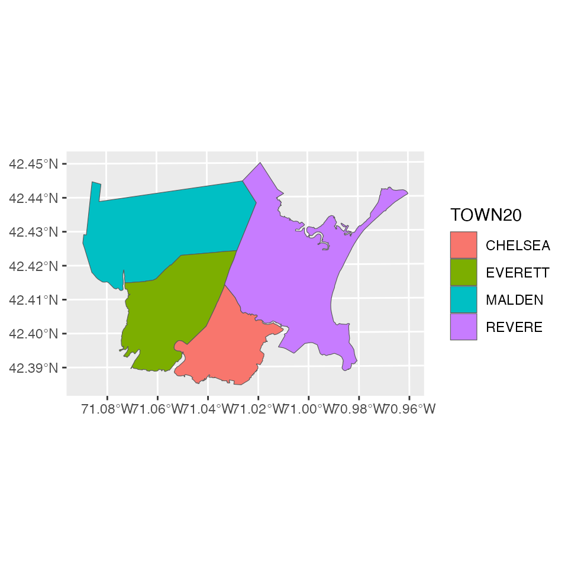
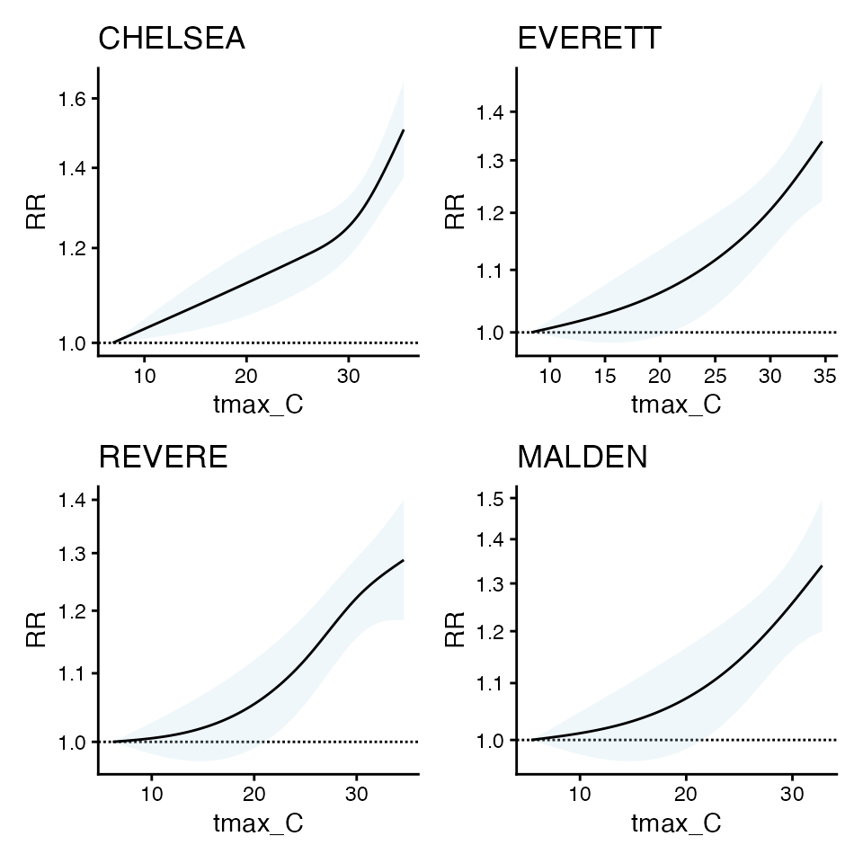

# Using Spatial Bayesian methods in \`cityHeatHealth\`

``` r

library(cityHeatHealth)
```

Another way that this model can be solved is by using Bayesian
inference, implemented in STAN. We are including this implementation
here so that it makes sense why we are including it later on.

The innovation here is combining the method of Armstrong 2014 with a
spatial method, in this case BYM2

We implemented the spatial bayesian method of BYM2 but instead of
regular poisson as a conditional poisson (i.e., multinomial) which has
performance gains that they articulate in Amrstrong.

This requires bringing in a shapefile, so you can define the network

The standard application is using MCMC

You can also experiment with speeding things up (at the risk of less
precise estimates) using the laplace or variational method. see Jack’s
notes as so what is going on here

``` r

library(data.table)
data("ma_exposure")
data("ma_deaths")

# create exposure matrix
exposure_columns <- list(
  "date" = "date",
  "exposure" = "tmax_C",
  "geo_unit" = "TOWN20",
  "geo_unit_grp" = "COUNTY20"
)

TOWNLIST <- c('CHELSEA', 'EVERETT', 'REVERE', 'MALDEN')

exposure <- subset(ma_exposure, TOWN20 %in%  TOWNLIST &
                     year(date) %in% 2012:2015)

exposure_mat <- make_exposure_matrix(exposure, exposure_columns)
#> Warning in make_exposure_matrix(exposure, exposure_columns): check about any NA, some corrections for this later,
#>             but only in certain columns

# create outcome table
outcome_columns <- list(
  "date" = "date",
  "outcome" = "daily_deaths",
  "factor" = 'age_grp',
  "factor" = 'sex',
  "geo_unit" = "TOWN20",
  "geo_unit_grp" = "COUNTY20"
)
deaths   <- subset(ma_deaths, TOWN20 %in%  TOWNLIST & 
                     year(date) %in% 2012:2015)
deaths_tbl <- make_outcome_table(deaths,  outcome_columns)

# plot
data("ma_towns")

library(ggplot2)
local_shp <- subset(ma_towns, TOWN20 %in%  TOWNLIST)
ggplot(local_shp) + geom_sf(aes(fill = TOWN20))
```



Now get initial estimates for each `geo_unit`

``` r

beta_l <- vector("list", 4) 
cr_l <- vector("list", 4) 
plot_l <- vector("list", 4)

cb_list <- vector("list", 4)
oo_list <- vector("list", 4)

for(bb in 1:4) {
  m1 <- condPois_1stage(
    subset(exposure_mat, TOWN20 == TOWNLIST[bb]),
    subset(deaths_tbl, TOWN20 == TOWNLIST[bb]))
  
  cb_list[[bb]] <- m1$`_`$out[[1]]$orig_basis
  oo_list[[bb]] <- m1$`_`$out[[1]]$outcomes
  
  beta_l[[bb]] <- m1$`_`$out[[1]]$orig_coef
  
  cr_l[[bb]] <- m1$`_`$out[[1]]$coef
  
  plot_l[[bb]] <- plot(m1)
  
}
mx <- do.call(cbind, beta_l) # COEFS NOT THE SAME
colnames(mx)  = TOWNLIST
mx
#>               CHELSEA     EVERETT        REVERE       MALDEN
#> cbv1.l1  0.0451309468  0.05298088 -0.0005224117  0.017711625
#> cbv1.l2 -0.0223211761 -0.03592669  0.0184129771  0.012490790
#> cbv1.l3  0.0873424413  0.08593669  0.1029649763  0.093454486
#> cbv1.l4 -0.0335859603 -0.03578575 -0.0337628164 -0.041517343
#> cbv2.l1  0.0852368471  0.05049362 -0.0533811289  0.039648824
#> cbv2.l2  0.0166508607 -0.11934992  0.0747314454  0.055829432
#> cbv2.l3  0.1926712791  0.18510476  0.1393985118  0.118837565
#> cbv2.l4 -0.0462482063 -0.04542133 -0.0608086198 -0.054356689
#> cbv3.l1  0.0170645385  0.07301390  0.0257165131  0.038563344
#> cbv3.l2 -0.0005616437 -0.06948122  0.0223225434 -0.002010598
#> cbv3.l3  0.1718665757  0.12512136  0.1186064940  0.130222731
#> cbv3.l4 -0.0490847643 -0.01913613 -0.0655887549 -0.044893272

mcr <- do.call(cbind, cr_l)   # COEFS THE SAME
colnames(mcr)  = TOWNLIST
mcr
#>      CHELSEA   EVERETT    REVERE    MALDEN
#> b1 0.1847675 0.1774954 0.2034421 0.1922760
#> b2 0.4637942 0.3065562 0.2523009 0.2921484
#> b3 0.3375227 0.2624969 0.2438566 0.2749740

library(patchwork)
wrap_plots(plot_l)
```



the cr coefs are similar

the orig_coefs are not, which is why beta-wise implementation of SB_DLNM
method doesn’t work - because the don’t have to be the same to produce
similar curves.

So, instead of forcing Beta to be similar, we can use bym2

refs:

- <https://mc-stan.org/learn-stan/case-studies/icar_stan.html>
- <https://link.springer.com/article/10.1186/1476-072X-4-31>
- <https://github.com/stan-dev/example-models/blob/e5b7d9e2e9ecc375805c7e49e4a4d4c1882b5e3b/knitr/car-iar-poisson/bym2_predictor_plus_offset.stan#L4>

ok here’s the ref of how LAPLACE works:

- <https://mc-stan.org/cmdstanr/reference/model-method-laplace.html>
- <https://statmodeling.stat.columbia.edu/2023/02/08/implementing-laplace-approximation-in-stan-whats-happening-under-the-hood/>

I think this makes for a good candidate because betas are normal and the
model is not hierarchical

\# and here
<https://discourse.mc-stan.org/t/r-package-using-cmdstanr/32758> \#
stan_file \<- system.file(“stan”, “SB_CondPoisson.stan”, \# package =
“cityHeatHealth”) \# \# mod \<- cmdstanr::cmdstan_model(stan_file, \#

``` r

m_sb1 <- condPois_sb(exposure_mat, deaths_tbl, local_shp, 
                     stan_type = 'mcmc',
                     verbose = 2,
                     stan_opts = list(refresh = 200),
                     use_spatial_model = 'none')
#> -- validation passed
#> -- prepare inputs
#> CHELSEA  EVERETT     MALDEN  REVERE  
#> Warning in getSW(shp = local_shp, ni = 1, include_self = F): has to be one
#> polygon per row in `shp`
#>      [,1] [,2] [,3] [,4]
#> [1,]    0    1    1    0
#> [2,]    1    0    1    1
#> [3,]    1    1    0    1
#> [4,]    0    1    1    0
#> 
#> -- run STAN
#> Running MCMC with 2 parallel chains...
#> 
#> Chain 1 Iteration:    1 / 2000 [  0%]  (Warmup) 
#> Chain 2 Iteration:    1 / 2000 [  0%]  (Warmup) 
#> Chain 2 Iteration:  200 / 2000 [ 10%]  (Warmup) 
#> Chain 1 Iteration:  200 / 2000 [ 10%]  (Warmup) 
#> Chain 2 Iteration:  400 / 2000 [ 20%]  (Warmup) 
#> Chain 1 Iteration:  400 / 2000 [ 20%]  (Warmup) 
#> Chain 2 Iteration:  600 / 2000 [ 30%]  (Warmup) 
#> Chain 1 Iteration:  600 / 2000 [ 30%]  (Warmup) 
#> Chain 2 Iteration:  800 / 2000 [ 40%]  (Warmup) 
#> Chain 1 Iteration:  800 / 2000 [ 40%]  (Warmup) 
#> Chain 2 Iteration: 1000 / 2000 [ 50%]  (Warmup) 
#> Chain 2 Iteration: 1001 / 2000 [ 50%]  (Sampling) 
#> Chain 1 Iteration: 1000 / 2000 [ 50%]  (Warmup) 
#> Chain 1 Iteration: 1001 / 2000 [ 50%]  (Sampling) 
#> Chain 2 Iteration: 1200 / 2000 [ 60%]  (Sampling) 
#> Chain 1 Iteration: 1200 / 2000 [ 60%]  (Sampling) 
#> Chain 1 Iteration: 1400 / 2000 [ 70%]  (Sampling) 
#> Chain 2 Iteration: 1400 / 2000 [ 70%]  (Sampling) 
#> Chain 1 Iteration: 1600 / 2000 [ 80%]  (Sampling) 
#> Chain 2 Iteration: 1600 / 2000 [ 80%]  (Sampling) 
#> Chain 1 Iteration: 1800 / 2000 [ 90%]  (Sampling) 
#> Chain 2 Iteration: 1800 / 2000 [ 90%]  (Sampling) 
#> Chain 2 Iteration: 2000 / 2000 [100%]  (Sampling) 
#> Chain 2 finished in 29.2 seconds.
#> Chain 1 Iteration: 2000 / 2000 [100%]  (Sampling) 
#> Chain 1 finished in 29.2 seconds.
#> 
#> Both chains finished successfully.
#> Mean chain execution time: 29.2 seconds.
#> Total execution time: 29.4 seconds.
#> 
#> CHELSEA  EVERETT     MALDEN  REVERE  
#> -- apply estimates
```

Compare, first you can see that with spatial_model = F, there is
similarity in beta coefs

``` r

mx
#>               CHELSEA     EVERETT        REVERE       MALDEN
#> cbv1.l1  0.0451309468  0.05298088 -0.0005224117  0.017711625
#> cbv1.l2 -0.0223211761 -0.03592669  0.0184129771  0.012490790
#> cbv1.l3  0.0873424413  0.08593669  0.1029649763  0.093454486
#> cbv1.l4 -0.0335859603 -0.03578575 -0.0337628164 -0.041517343
#> cbv2.l1  0.0852368471  0.05049362 -0.0533811289  0.039648824
#> cbv2.l2  0.0166508607 -0.11934992  0.0747314454  0.055829432
#> cbv2.l3  0.1926712791  0.18510476  0.1393985118  0.118837565
#> cbv2.l4 -0.0462482063 -0.04542133 -0.0608086198 -0.054356689
#> cbv3.l1  0.0170645385  0.07301390  0.0257165131  0.038563344
#> cbv3.l2 -0.0005616437 -0.06948122  0.0223225434 -0.002010598
#> cbv3.l3  0.1718665757  0.12512136  0.1186064940  0.130222731
#> cbv3.l4 -0.0490847643 -0.01913613 -0.0655887549 -0.044893272

m_sb1$`_`$beta_mat
#>           CHELSEA     EVERETT      MALDEN        REVERE
#>  [1,]  0.04563081  0.05352101  0.01681938 -0.0007161936
#>  [2,] -0.02310974 -0.03545623  0.01349965  0.0180104763
#>  [3,]  0.08724563  0.08576537  0.09334545  0.1028893168
#>  [4,] -0.03350999 -0.03532395 -0.04105760 -0.0331877843
#>  [5,]  0.08698833  0.04810957  0.03598086 -0.0511078793
#>  [6,]  0.01534864 -0.11608512  0.06032731  0.0744266904
#>  [7,]  0.19255327  0.18545340  0.11679099  0.1364912451
#>  [8,] -0.04584014 -0.04524805 -0.05158503 -0.0596107002
#>  [9,]  0.01789267  0.07015688  0.03754349  0.0284379689
#> [10,] -0.00093469 -0.06706039 -0.00138018  0.0211865836
#> [11,]  0.17143376  0.12552996  0.12973764  0.1171559579
#> [12,] -0.04891770 -0.02000770 -0.04463672 -0.0651447948
```

### Compare with spatial model

using laplace in this case, but you could try mcmc

``` r

m_sb2 <- condPois_sb(exposure_mat, deaths_tbl, local_shp, 
                     stan_type = 'laplace',
                     verbose = 2,
                     stan_opts = list(refresh = 200),
                     use_spatial_model = 'bym2')
#> -- validation passed
#> -- prepare inputs
#> CHELSEA  EVERETT     MALDEN  REVERE  
#> Warning in getSW(shp = local_shp, ni = 1, include_self = F): has to be one
#> polygon per row in `shp`
#>      [,1] [,2] [,3] [,4]
#> [1,]    0    1    1    0
#> [2,]    1    0    1    1
#> [3,]    1    1    0    1
#> [4,]    0    1    1    0
#> 
#> -- run STAN
#> Initial log joint probability = -6739.06 
#>     Iter      log prob        ||dx||      ||grad||       alpha      alpha0  # evals  Notes  
#>      139      -6737.26   0.000348121      0.731762           1           1      169    
#> Optimization terminated normally:  
#>   Convergence detected: relative gradient magnitude is below tolerance 
#> Finished in  0.1 seconds.
#> Calculating Hessian 
#> Calculating inverse of Cholesky factor 
#> Generating draws 
#> iteration: 0 
#> iteration: 100 
#> iteration: 200 
#> iteration: 300 
#> iteration: 400 
#> iteration: 500 
#> iteration: 600 
#> iteration: 700 
#> iteration: 800 
#> iteration: 900 
#> Finished in  0.7 seconds.
#> CHELSEA  EVERETT     MALDEN  REVERE  
#> -- apply estimates
```

Compare, now you can see these are different

``` r

mx
#>               CHELSEA     EVERETT        REVERE       MALDEN
#> cbv1.l1  0.0451309468  0.05298088 -0.0005224117  0.017711625
#> cbv1.l2 -0.0223211761 -0.03592669  0.0184129771  0.012490790
#> cbv1.l3  0.0873424413  0.08593669  0.1029649763  0.093454486
#> cbv1.l4 -0.0335859603 -0.03578575 -0.0337628164 -0.041517343
#> cbv2.l1  0.0852368471  0.05049362 -0.0533811289  0.039648824
#> cbv2.l2  0.0166508607 -0.11934992  0.0747314454  0.055829432
#> cbv2.l3  0.1926712791  0.18510476  0.1393985118  0.118837565
#> cbv2.l4 -0.0462482063 -0.04542133 -0.0608086198 -0.054356689
#> cbv3.l1  0.0170645385  0.07301390  0.0257165131  0.038563344
#> cbv3.l2 -0.0005616437 -0.06948122  0.0223225434 -0.002010598
#> cbv3.l3  0.1718665757  0.12512136  0.1186064940  0.130222731
#> cbv3.l4 -0.0490847643 -0.01913613 -0.0655887549 -0.044893272

m_sb2$`_`$beta_mat
#>            CHELSEA     EVERETT        MALDEN        REVERE
#>  [1,]  0.045423333  0.05112039  1.900732e-02  0.0003361363
#>  [2,] -0.021520151 -0.03348218  1.168377e-02  0.0171357910
#>  [3,]  0.086169530  0.08576237  9.202635e-02  0.1026162647
#>  [4,] -0.033034684 -0.03701113 -4.046737e-02 -0.0336513220
#>  [5,]  0.088049683  0.04858261  3.603389e-02 -0.0514857925
#>  [6,]  0.019462978 -0.11101076  6.234808e-02  0.0752953200
#>  [7,]  0.187765616  0.18230330  1.161435e-01  0.1368418551
#>  [8,] -0.042253687 -0.04710544 -5.393741e-02 -0.0612077042
#>  [9,]  0.016094283  0.07222675  3.729183e-02  0.0263192109
#> [10,]  0.001261148 -0.06617505  4.976655e-05  0.0224012337
#> [11,]  0.172412859  0.12429712  1.292206e-01  0.1186910900
#> [12,] -0.048785974 -0.01986296 -4.510412e-02 -0.0658182839
```

### Compare with spatial model for leroux

using laplace in this case, but you could try mcmc

``` r

m_sb3 <- condPois_sb(exposure_mat, 
                     deaths_tbl, local_shp, 
                     stan_type = 'laplace',
                     verbose = 2,
                     stan_opts = list(refresh = 200),
                     use_spatial_model = 'leroux')
#> -- validation passed
#> -- prepare inputs
#> CHELSEA  EVERETT     MALDEN  REVERE  
#> Warning in getSW(shp = local_shp, ni = 1, include_self = F): has to be one
#> polygon per row in `shp`
#>      [,1] [,2] [,3] [,4]
#> [1,]    0    1    1    0
#> [2,]    1    0    1    1
#> [3,]    1    1    0    1
#> [4,]    0    1    1    0
#> 
#> -- run STAN
#> Initial log joint probability = -7000.25 
#>     Iter      log prob        ||dx||      ||grad||       alpha      alpha0  # evals  Notes  
#>      199      -6508.32      0.101312       735.672           1           1      210    
#>     Iter      log prob        ||dx||      ||grad||       alpha      alpha0  # evals  Notes  
#>      399      -6441.08   0.000602857       2011.02           1           1      415    
#>     Iter      log prob        ||dx||      ||grad||       alpha      alpha0  # evals  Notes  
#>      599      -6421.17    0.00168537       2169.19           1           1      622    
#>     Iter      log prob        ||dx||      ||grad||       alpha      alpha0  # evals  Notes  
#>      799      -6419.21   0.000241764       2033.04           1           1      828    
#>     Iter      log prob        ||dx||      ||grad||       alpha      alpha0  # evals  Notes  
#>      999      -6418.36   3.55337e-05       1137.51           1           1     1040    
#>     Iter      log prob        ||dx||      ||grad||       alpha      alpha0  # evals  Notes  
#>     1199      -6418.11   2.18947e-05       273.309           1           1     1249    
#>     Iter      log prob        ||dx||      ||grad||       alpha      alpha0  # evals  Notes  
#>     1399      -6417.96   4.21693e-06       290.011      0.2871      0.2871     1456    
#>     Iter      log prob        ||dx||      ||grad||       alpha      alpha0  # evals  Notes  
#>     1599      -6417.82   8.38522e-06       266.515           1           1     1668    
#>     Iter      log prob        ||dx||      ||grad||       alpha      alpha0  # evals  Notes  
#>     1799      -6417.66   8.43777e-06       127.557           1           1     1875    
#>     Iter      log prob        ||dx||      ||grad||       alpha      alpha0  # evals  Notes  
#>     1999      -6417.53   1.57883e-05       374.016       0.666       0.666     2084    
#>     Iter      log prob        ||dx||      ||grad||       alpha      alpha0  # evals  Notes  
#>     2199      -6417.41   2.03482e-05       234.158           1           1     2294    
#>     Iter      log prob        ||dx||      ||grad||       alpha      alpha0  # evals  Notes  
#>     2399      -6417.37   0.000196685       263.952           1           1     2505    
#>     Iter      log prob        ||dx||      ||grad||       alpha      alpha0  # evals  Notes  
#>     2599      -6417.27    0.00020019        874.02           1           1     2712    
#>     Iter      log prob        ||dx||      ||grad||       alpha      alpha0  # evals  Notes  
#>     2799       -6417.2   2.31778e-05       282.484      0.8335      0.8335     2922    
#>     Iter      log prob        ||dx||      ||grad||       alpha      alpha0  # evals  Notes  
#>     2917      -6417.09   5.16008e-07       58.1118           1           1     3045    
#> Optimization terminated normally:  
#>   Convergence detected: relative gradient magnitude is below tolerance 
#> Finished in  1.4 seconds.
#> Calculating Hessian 
#> Calculating inverse of Cholesky factor 
#> Generating draws 
#> iteration: 0 
#> iteration: 100 
#> iteration: 200 
#> iteration: 300 
#> iteration: 400 
#> iteration: 500 
#> iteration: 600 
#> iteration: 700 
#> iteration: 800 
#> iteration: 900 
#> Finished in  0.8 seconds.
#> CHELSEA  EVERETT     MALDEN  REVERE  
#> -- apply estimates
```

As you can see, lots of smoothing to a central estimate !

``` r

mx
#>               CHELSEA     EVERETT        REVERE       MALDEN
#> cbv1.l1  0.0451309468  0.05298088 -0.0005224117  0.017711625
#> cbv1.l2 -0.0223211761 -0.03592669  0.0184129771  0.012490790
#> cbv1.l3  0.0873424413  0.08593669  0.1029649763  0.093454486
#> cbv1.l4 -0.0335859603 -0.03578575 -0.0337628164 -0.041517343
#> cbv2.l1  0.0852368471  0.05049362 -0.0533811289  0.039648824
#> cbv2.l2  0.0166508607 -0.11934992  0.0747314454  0.055829432
#> cbv2.l3  0.1926712791  0.18510476  0.1393985118  0.118837565
#> cbv2.l4 -0.0462482063 -0.04542133 -0.0608086198 -0.054356689
#> cbv3.l1  0.0170645385  0.07301390  0.0257165131  0.038563344
#> cbv3.l2 -0.0005616437 -0.06948122  0.0223225434 -0.002010598
#> cbv3.l3  0.1718665757  0.12512136  0.1186064940  0.130222731
#> cbv3.l4 -0.0490847643 -0.01913613 -0.0655887549 -0.044893272

m_sb3$`_`$beta_mat
#>            CHELSEA      EVERETT      MALDEN       REVERE
#>  [1,]  0.026319525  0.026319693  0.02631967  0.026319835
#>  [2,] -0.005534506 -0.005534296 -0.00553427 -0.005534043
#>  [3,]  0.094720528  0.094720723  0.09472093  0.094721223
#>  [4,] -0.036462337 -0.036462215 -0.03646218 -0.036462030
#>  [5,]  0.017719019  0.017712262  0.01771736  0.017710263
#>  [6,]  0.011331487  0.011330544  0.01133091  0.011329994
#>  [7,]  0.160040095  0.160039608  0.16003934  0.160039051
#>  [8,] -0.054106971 -0.054107011 -0.05410700 -0.054106990
#>  [9,]  0.036384050  0.036384133  0.03638422  0.036384400
#> [10,] -0.011483545 -0.011483506 -0.01148341 -0.011483331
#> [11,]  0.134981224  0.134980961  0.13498120  0.134981046
#> [12,] -0.045758154 -0.045758204 -0.04575826 -0.045758549
```

And you can also see that the leroux `q` value is quite high

``` r

subset(m_sb3$`_`$stan_summary, variable == 'q')
#> # A tibble: 1 × 7
#>   variable  mean median    sd     mad    q5   q95
#>   <chr>    <dbl>  <dbl> <dbl>   <dbl> <dbl> <dbl>
#> 1 q        0.936  0.998 0.181 0.00129 0.474 0.999
```

Other bayesian notes

> > need to update to be the number of unique networks, because right
> > now there are too many degree of freedom

–\> what if you did not just n = 1 neighbors. whats about n = 2
neighbors with a weighting factor on neighbors that are 2 away? I think
thins should work. but you’ll have to rework the STAN code so there are
fewer

so you’ll have to have windows and update this // \*\*\*\*\* matrix\[K,
J\] beta = rep_matrix(mu, J) + beta_star; // \*\*\*\*\* and update the
y\[ \] to be compared to multiple versions this is the way that that
comes back around and the bigger smoothness, the fewer spatial networks

–\> right because again the problem of this is it doesn’t actually
reduce the number of the problem. so the level of smoothing yes is
determined by the user by saying how many levels of neighbors to use but

–\> ah ha, the problem there is (just like EpiEstim) you won’t actually
get betas for everyplace –\> but wait, you actually can if you do the
poor-man’s recursion. so the point would be you can have a 2-degree
neighbor beta expressed in each of the J places, and then you can do
just like in otherwise the ys, which would then give you region-specific
betas (much like daily R(t)s).

–\> and maybe the two stage can be a weighted average?

–\> probably might make sense to do look at how other people do
spatial-temporal Poisson rather than doing it yourself. ChatGPT had some
ideas (“low rank”)

–\> and its going to do better than EpiEstim because its not going to
scale with the dataset. if anything it will get easier with more data.

–\> Essentially, the SB is a bridge between and 1 stage and a 2 stage if
you want more granularity than a 1 stage, but the data aren’t strong
enough to do a 2 stage even with blups, you can do an SB model, which is
sortof like many overlapping 1 stage models of larger spatial groups
fused together
