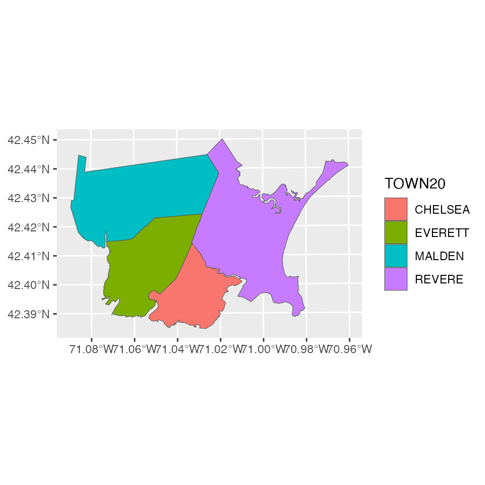
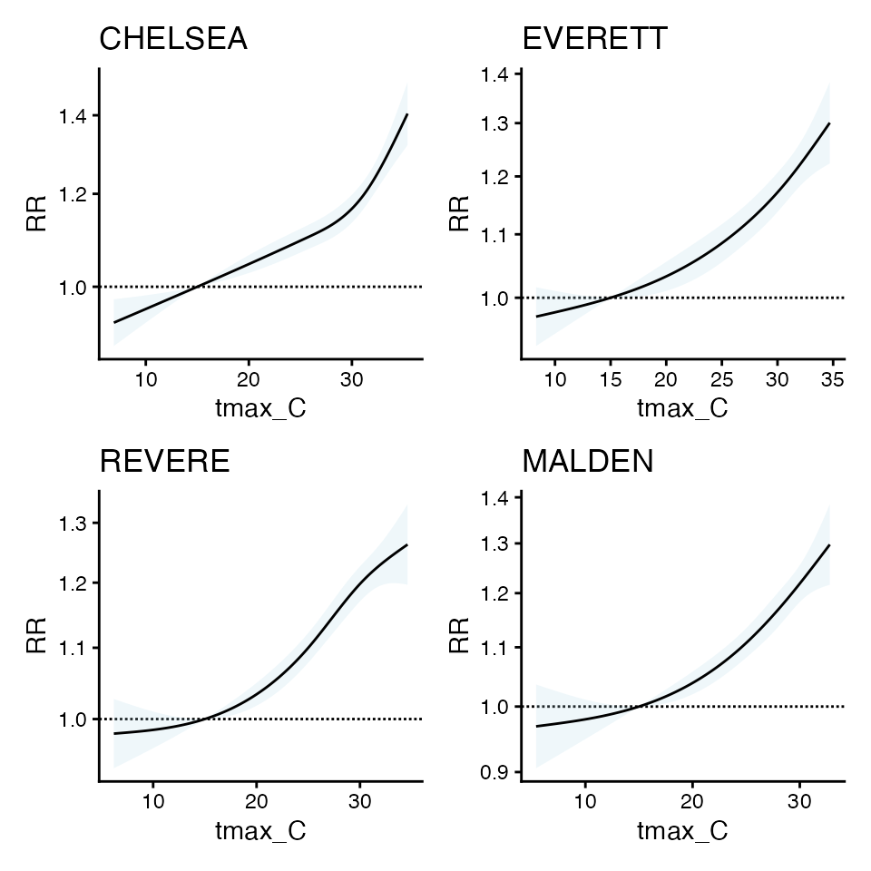

# Using Spatial Bayesian methods in \`cityHeatHealth\`

``` r

library(cityHeatHealth)
```

Another way that this model can be solved is by using Bayesian
inference, implemented in STAN. We are including this implementation
here so that it makes sense why we are including it later on.

The innovation here is combining the method of Armstrong 2014 with a
spatial method, in this case BYM2

We implemented the spatial bayesian method of BYM2 but instead of
regular poisson as a conditional poisson (i.e., multinomial) which has
performance gains that they articulate in Amrstrong.

This requires bringing in a shapefile, so you can define the network

The standard application is using MCMC, we also include all STAN model
types:

- MCMC
- laplace
- variational
- pathfinder

You can also experiment with speeding things up (at the risk of less
precise estimates) using the laplace or variational method. see Jack’s
notes as so what is going on here

``` r

library(data.table)
data("ma_exposure")
data("ma_deaths")

# create exposure matrix
exposure_columns <- list(
  "date" = "date",
  "exposure" = "tmax_C",
  "geo_unit" = "TOWN20",
  "geo_unit_grp" = "COUNTY20"
)

TOWNLIST <- c('CHELSEA', 'EVERETT', 'REVERE', 'MALDEN')

exposure <- subset(ma_exposure, TOWN20 %in%  TOWNLIST & year(date) %in% 2012:2015)

exposure_mat <- make_exposure_matrix(exposure, exposure_columns)
#> Warning in make_exposure_matrix(exposure, exposure_columns): check about any NA, some corrections for this later,
#>             but only in certain columns

# create outcome table
outcome_columns <- list(
  "date" = "date",
  "outcome" = "daily_deaths",
  "factor" = 'age_grp',
  "factor" = 'sex',
  "geo_unit" = "TOWN20",
  "geo_unit_grp" = "COUNTY20"
)
deaths   <- subset(ma_deaths, TOWN20 %in% TOWNLIST & year(date) %in% 2012:2015)
deaths_tbl <- make_outcome_table(deaths,  outcome_columns)

# plot
data("ma_towns")

library(ggplot2)
local_shp <- subset(ma_towns, TOWN20 %in%  TOWNLIST)
ggplot(local_shp) + geom_sf(aes(fill = TOWN20))
```



Now get initial estimates for each `geo_unit`

``` r

beta_l <- vector("list", 4) 
cr_l <- vector("list", 4) 
plot_l <- vector("list", 4)

cb_list <- vector("list", 4)
oo_list <- vector("list", 4)

for(bb in 1:4) {
  m1 <- condPois_1stage(
    subset(exposure_mat, TOWN20 == TOWNLIST[bb]),
    subset(deaths_tbl, TOWN20 == TOWNLIST[bb]))
  
  cb_list[[bb]] <- m1$`_`$out[[1]]$orig_basis
  oo_list[[bb]] <- m1$`_`$out[[1]]$outcomes
  
  beta_l[[bb]] <- m1$`_`$out[[1]]$orig_coef
  
  cr_l[[bb]] <- m1$`_`$out[[1]]$coef
  
  plot_l[[bb]] <- plot(m1)
  
}
#> Warning in condPois_1stage(subset(exposure_mat, TOWN20 == TOWNLIST[bb]), :
#> Centering point is outside the range of exposures in geo-unit CHELSEA. This
#> means your zones are across too large of an area, or there are differences in
#> exposures so much that the bases are quite different. Try limiting the
#> geo-units passed in to those that are more similar, manually setting a
#> centering point that you know each geo-unit has, or changing your exposure
#> variable.
#> Warning in condPois_1stage(subset(exposure_mat, TOWN20 == TOWNLIST[bb]), :
#> Centering point is outside the range of exposures in geo-unit REVERE. This
#> means your zones are across too large of an area, or there are differences in
#> exposures so much that the bases are quite different. Try limiting the
#> geo-units passed in to those that are more similar, manually setting a
#> centering point that you know each geo-unit has, or changing your exposure
#> variable.
mx <- do.call(cbind, beta_l) # COEFS NOT THE SAME
colnames(mx)  = TOWNLIST
mx
#>               CHELSEA     EVERETT        REVERE       MALDEN
#> cbv1.l1  0.0451309468  0.05298088 -0.0005224117  0.017711625
#> cbv1.l2 -0.0223211761 -0.03592669  0.0184129771  0.012490790
#> cbv1.l3  0.0873424413  0.08593669  0.1029649763  0.093454486
#> cbv1.l4 -0.0335859603 -0.03578575 -0.0337628164 -0.041517343
#> cbv2.l1  0.0852368471  0.05049362 -0.0533811289  0.039648824
#> cbv2.l2  0.0166508607 -0.11934992  0.0747314454  0.055829432
#> cbv2.l3  0.1926712791  0.18510476  0.1393985118  0.118837565
#> cbv2.l4 -0.0462482063 -0.04542133 -0.0608086198 -0.054356689
#> cbv3.l1  0.0170645385  0.07301390  0.0257165131  0.038563344
#> cbv3.l2 -0.0005616437 -0.06948122  0.0223225434 -0.002010598
#> cbv3.l3  0.1718665757  0.12512136  0.1186064940  0.130222731
#> cbv3.l4 -0.0490847643 -0.01913613 -0.0655887549 -0.044893272

mcr <- do.call(cbind, cr_l)   # COEFS THE SAME
colnames(mcr)  = TOWNLIST
mcr
#>      CHELSEA   EVERETT    REVERE    MALDEN
#> b1 0.1847675 0.1774954 0.2034421 0.1922760
#> b2 0.4637942 0.3065562 0.2523009 0.2921484
#> b3 0.3375227 0.2624969 0.2438566 0.2749740

library(patchwork)
wrap_plots(plot_l)
```



the cr coefs are similar

the orig_coefs are not, which is why beta-wise implementation of SB_DLNM
method doesn’t work - because the don’t have to be the same to produce
similar curves.

So, instead of forcing Beta to be similar, we can use bym2

refs:

- <https://mc-stan.org/learn-stan/case-studies/icar_stan.html>
- <https://link.springer.com/article/10.1186/1476-072X-4-31>
- <https://github.com/stan-dev/example-models/blob/e5b7d9e2e9ecc375805c7e49e4a4d4c1882b5e3b/knitr/car-iar-poisson/bym2_predictor_plus_offset.stan#L4>

ok here’s the ref of how LAPLACE works:

- <https://mc-stan.org/cmdstanr/reference/model-method-laplace.html>
- <https://statmodeling.stat.columbia.edu/2023/02/08/implementing-laplace-approximation-in-stan-whats-happening-under-the-hood/>

I think this makes for a good candidate because betas are normal and the
model is not hierarchical

``` r

m_sb1 <- condPois_sb(exposure_mat, deaths_tbl, local_shp, 
                     stan_type = 'mcmc',
                     verbose = 2,
                     stan_opts = list(refresh = 200),
                     use_spatial_model = 'none')
#>  STAN TYPE = mcmc 
#>  SPATIAL MODEL = none 
#> -- validation passed
#> -- prepare inputs
#> CHELSEA  
#> Warning in condPois_1stage(exposure_matrix = single_exposure_matrix,
#> outcomes_tbl = single_outcomes_tbl, : Centering point is outside the range of
#> exposures in geo-unit CHELSEA. This means your zones are across too large of an
#> area, or there are differences in exposures so much that the bases are quite
#> different. Try limiting the geo-units passed in to those that are more similar,
#> manually setting a centering point that you know each geo-unit has, or changing
#> your exposure variable.
#> EVERETT  MALDEN  REVERE  
#> Warning in condPois_1stage(exposure_matrix = single_exposure_matrix,
#> outcomes_tbl = single_outcomes_tbl, : Centering point is outside the range of
#> exposures in geo-unit REVERE. This means your zones are across too large of an
#> area, or there are differences in exposures so much that the bases are quite
#> different. Try limiting the geo-units passed in to those that are more similar,
#> manually setting a centering point that you know each geo-unit has, or changing
#> your exposure variable.
#> Warning in getSW(shp = shp_sf_safe, ni = 1, include_self = F): has to be one
#> polygon per row in `shp`
#> 
#> -- run STAN
#>  ...mcmc... 
#> Running MCMC with 2 parallel chains...
#> 
#> Chain 1 Iteration:    1 / 2000 [  0%]  (Warmup) 
#> Chain 2 Iteration:    1 / 2000 [  0%]  (Warmup) 
#> Chain 1 Iteration:  200 / 2000 [ 10%]  (Warmup) 
#> Chain 2 Iteration:  200 / 2000 [ 10%]  (Warmup) 
#> Chain 1 Iteration:  400 / 2000 [ 20%]  (Warmup) 
#> Chain 2 Iteration:  400 / 2000 [ 20%]  (Warmup) 
#> Chain 1 Iteration:  600 / 2000 [ 30%]  (Warmup) 
#> Chain 2 Iteration:  600 / 2000 [ 30%]  (Warmup) 
#> Chain 1 Iteration:  800 / 2000 [ 40%]  (Warmup) 
#> Chain 2 Iteration:  800 / 2000 [ 40%]  (Warmup) 
#> Chain 1 Iteration: 1000 / 2000 [ 50%]  (Warmup) 
#> Chain 1 Iteration: 1001 / 2000 [ 50%]  (Sampling) 
#> Chain 2 Iteration: 1000 / 2000 [ 50%]  (Warmup) 
#> Chain 2 Iteration: 1001 / 2000 [ 50%]  (Sampling) 
#> Chain 1 Iteration: 1200 / 2000 [ 60%]  (Sampling) 
#> Chain 2 Iteration: 1200 / 2000 [ 60%]  (Sampling) 
#> Chain 1 Iteration: 1400 / 2000 [ 70%]  (Sampling) 
#> Chain 2 Iteration: 1400 / 2000 [ 70%]  (Sampling) 
#> Chain 2 Iteration: 1600 / 2000 [ 80%]  (Sampling) 
#> Chain 1 Iteration: 1600 / 2000 [ 80%]  (Sampling) 
#> Chain 2 Iteration: 1800 / 2000 [ 90%]  (Sampling) 
#> Chain 1 Iteration: 1800 / 2000 [ 90%]  (Sampling) 
#> Chain 2 Iteration: 2000 / 2000 [100%]  (Sampling) 
#> Chain 2 finished in 29.7 seconds.
#> Chain 1 Iteration: 2000 / 2000 [100%]  (Sampling) 
#> Chain 1 finished in 30.4 seconds.
#> 
#> Both chains finished successfully.
#> Mean chain execution time: 30.0 seconds.
#> Total execution time: 30.4 seconds.
#> 
#>  ...mcmc draws... 
#> CHELSEA  EVERETT     MALDEN  REVERE  
#> -- apply estimates
```

Compare, first you can see that with spatial_model = F, there is
similarity in beta coefs

``` r

mx
#>               CHELSEA     EVERETT        REVERE       MALDEN
#> cbv1.l1  0.0451309468  0.05298088 -0.0005224117  0.017711625
#> cbv1.l2 -0.0223211761 -0.03592669  0.0184129771  0.012490790
#> cbv1.l3  0.0873424413  0.08593669  0.1029649763  0.093454486
#> cbv1.l4 -0.0335859603 -0.03578575 -0.0337628164 -0.041517343
#> cbv2.l1  0.0852368471  0.05049362 -0.0533811289  0.039648824
#> cbv2.l2  0.0166508607 -0.11934992  0.0747314454  0.055829432
#> cbv2.l3  0.1926712791  0.18510476  0.1393985118  0.118837565
#> cbv2.l4 -0.0462482063 -0.04542133 -0.0608086198 -0.054356689
#> cbv3.l1  0.0170645385  0.07301390  0.0257165131  0.038563344
#> cbv3.l2 -0.0005616437 -0.06948122  0.0223225434 -0.002010598
#> cbv3.l3  0.1718665757  0.12512136  0.1186064940  0.130222731
#> cbv3.l4 -0.0490847643 -0.01913613 -0.0655887549 -0.044893272

m_sb1$`_`$beta_mat
#>             CHELSEA     EVERETT       MALDEN        REVERE
#>  [1,]  4.683388e-02  0.05294822  0.017468417  0.0001073269
#>  [2,] -2.222987e-02 -0.03545745  0.012447244  0.0176797371
#>  [3,]  8.665067e-02  0.08563174  0.093459260  0.1030138685
#>  [4,] -3.290372e-02 -0.03583985 -0.041595504 -0.0341954723
#>  [5,]  8.824432e-02  0.04997567  0.039592940 -0.0510218024
#>  [6,]  1.807413e-02 -0.11685118  0.055468393  0.0724250820
#>  [7,]  1.902668e-01  0.18455297  0.118991355  0.1362768009
#>  [8,] -4.510138e-02 -0.04564177 -0.053108560 -0.0600076698
#>  [9,]  1.813406e-02  0.07161025  0.039018690  0.0257039363
#> [10,]  3.408603e-05 -0.06838950 -0.002237786  0.0214171417
#> [11,]  1.711990e-01  0.12585342  0.130526914  0.1179931668
#> [12,] -4.859838e-02 -0.01956165 -0.044172808 -0.0658578432
```

### Compare with spatial model

using laplace in this case, but you could try mcmc

``` r

m_sb2 <- condPois_sb(exposure_mat, deaths_tbl, local_shp, 
                     stan_type = 'laplace',
                     verbose = 2,
                     stan_opts = list(refresh = 200),
                     use_spatial_model = 'bym2')
#>  STAN TYPE = laplace 
#>  SPATIAL MODEL = bym2 
#> -- validation passed
#> -- prepare inputs
#> CHELSEA  
#> Warning in condPois_1stage(exposure_matrix = single_exposure_matrix,
#> outcomes_tbl = single_outcomes_tbl, : Centering point is outside the range of
#> exposures in geo-unit CHELSEA. This means your zones are across too large of an
#> area, or there are differences in exposures so much that the bases are quite
#> different. Try limiting the geo-units passed in to those that are more similar,
#> manually setting a centering point that you know each geo-unit has, or changing
#> your exposure variable.
#> EVERETT  MALDEN  REVERE  
#> Warning in condPois_1stage(exposure_matrix = single_exposure_matrix,
#> outcomes_tbl = single_outcomes_tbl, : Centering point is outside the range of
#> exposures in geo-unit REVERE. This means your zones are across too large of an
#> area, or there are differences in exposures so much that the bases are quite
#> different. Try limiting the geo-units passed in to those that are more similar,
#> manually setting a centering point that you know each geo-unit has, or changing
#> your exposure variable.
#> Warning in getSW(shp = shp_sf_safe, ni = 1, include_self = F): has to be one
#> polygon per row in `shp`
#> 
#> -- run STAN
#>  ...laplace optimize... 
#> Initial log joint probability = -6739.06 
#>     Iter      log prob        ||dx||      ||grad||       alpha      alpha0  # evals  Notes  
#>      199      -6737.26   0.000468068       1.77627           1           1      229    
#>     Iter      log prob        ||dx||      ||grad||       alpha      alpha0  # evals  Notes  
#>      232      -6737.26    0.00013038      0.878042           1           1      268    
#> Optimization terminated normally:  
#>   Convergence detected: relative gradient magnitude is below tolerance 
#> Finished in  0.2 seconds.
#>  ...laplace sample... 
#> Calculating Hessian 
#> Calculating inverse of Cholesky factor 
#> Generating draws 
#> iteration: 0 
#> iteration: 100 
#> iteration: 200 
#> iteration: 300 
#> iteration: 400 
#> iteration: 500 
#> iteration: 600 
#> iteration: 700 
#> iteration: 800 
#> iteration: 900 
#> Finished in  0.7 seconds.
#>  ...laplace draws... 
#> CHELSEA  EVERETT     MALDEN  REVERE  
#> -- apply estimates
```

Compare, now you can see these are different

``` r

mx
#>               CHELSEA     EVERETT        REVERE       MALDEN
#> cbv1.l1  0.0451309468  0.05298088 -0.0005224117  0.017711625
#> cbv1.l2 -0.0223211761 -0.03592669  0.0184129771  0.012490790
#> cbv1.l3  0.0873424413  0.08593669  0.1029649763  0.093454486
#> cbv1.l4 -0.0335859603 -0.03578575 -0.0337628164 -0.041517343
#> cbv2.l1  0.0852368471  0.05049362 -0.0533811289  0.039648824
#> cbv2.l2  0.0166508607 -0.11934992  0.0747314454  0.055829432
#> cbv2.l3  0.1926712791  0.18510476  0.1393985118  0.118837565
#> cbv2.l4 -0.0462482063 -0.04542133 -0.0608086198 -0.054356689
#> cbv3.l1  0.0170645385  0.07301390  0.0257165131  0.038563344
#> cbv3.l2 -0.0005616437 -0.06948122  0.0223225434 -0.002010598
#> cbv3.l3  0.1718665757  0.12512136  0.1186064940  0.130222731
#> cbv3.l4 -0.0490847643 -0.01913613 -0.0655887549 -0.044893272

m_sb2$`_`$beta_mat
#>             CHELSEA     EVERETT        MALDEN        REVERE
#>  [1,]  0.0456144425  0.05117239  0.0195011013  0.0004048702
#>  [2,] -0.0217211816 -0.03359018  0.0113808699  0.0169380897
#>  [3,]  0.0861152413  0.08575906  0.0918709489  0.1026532714
#>  [4,] -0.0329315743 -0.03698782 -0.0403725654 -0.0336250174
#>  [5,]  0.0888888496  0.04875261  0.0366123422 -0.0507667006
#>  [6,]  0.0188867502 -0.11160078  0.0617633507  0.0742922247
#>  [7,]  0.1879445945  0.18249027  0.1160995436  0.1366748806
#>  [8,] -0.0422318686 -0.04712114 -0.0540226950 -0.0611001987
#>  [9,]  0.0163390938  0.07226775  0.0374702258  0.0266458050
#> [10,]  0.0008881351 -0.06639245 -0.0002536605  0.0222343284
#> [11,]  0.1725718609  0.12436911  0.1292915760  0.1184521041
#> [12,] -0.0487021783 -0.01980725 -0.0450983186 -0.0656967898
```

### Compare with spatial model for leroux

using laplace in this case, but you could try mcmc

``` r

m_sb3 <- condPois_sb(exposure_mat, 
                     deaths_tbl, local_shp, 
                     stan_type = 'laplace',
                     verbose = 2,
                     stan_opts = list(refresh = 200),
                     use_spatial_model = 'leroux')
#>  STAN TYPE = laplace 
#>  SPATIAL MODEL = leroux 
#> -- validation passed
#> -- prepare inputs
#> CHELSEA  
#> Warning in condPois_1stage(exposure_matrix = single_exposure_matrix,
#> outcomes_tbl = single_outcomes_tbl, : Centering point is outside the range of
#> exposures in geo-unit CHELSEA. This means your zones are across too large of an
#> area, or there are differences in exposures so much that the bases are quite
#> different. Try limiting the geo-units passed in to those that are more similar,
#> manually setting a centering point that you know each geo-unit has, or changing
#> your exposure variable.
#> EVERETT  MALDEN  REVERE  
#> Warning in condPois_1stage(exposure_matrix = single_exposure_matrix,
#> outcomes_tbl = single_outcomes_tbl, : Centering point is outside the range of
#> exposures in geo-unit REVERE. This means your zones are across too large of an
#> area, or there are differences in exposures so much that the bases are quite
#> different. Try limiting the geo-units passed in to those that are more similar,
#> manually setting a centering point that you know each geo-unit has, or changing
#> your exposure variable.
#> Warning in getSW(shp = shp_sf_safe, ni = 1, include_self = F): has to be one
#> polygon per row in `shp`
#> 
#> -- run STAN
#>  ...laplace optimize... 
#> Initial log joint probability = -7000.25 
#>     Iter      log prob        ||dx||      ||grad||       alpha      alpha0  # evals  Notes  
#>      199      -6475.41   0.000236962       256.203           1           1      215    
#>     Iter      log prob        ||dx||      ||grad||       alpha      alpha0  # evals  Notes  
#>      399      -6473.24    0.00131717       511.993           1           1      421    
#>     Iter      log prob        ||dx||      ||grad||       alpha      alpha0  # evals  Notes  
#>      599      -6472.41   0.000221956       90.7614           1           1      627    
#>     Iter      log prob        ||dx||      ||grad||       alpha      alpha0  # evals  Notes  
#>      799      -6471.42    0.00113655        702.47           1           1      842    
#>     Iter      log prob        ||dx||      ||grad||       alpha      alpha0  # evals  Notes  
#>      999      -6469.96   0.000132048       160.837           1           1     1047    
#>     Iter      log prob        ||dx||      ||grad||       alpha      alpha0  # evals  Notes  
#>     1199      -6469.44   0.000165088       95.2499           1           1     1257    
#>     Iter      log prob        ||dx||      ||grad||       alpha      alpha0  # evals  Notes  
#>     1399      -6467.31     0.0042069        476.27           1           1     1465    
#>     Iter      log prob        ||dx||      ||grad||       alpha      alpha0  # evals  Notes  
#>     1599       -6458.3    0.00324772        885.07           1           1     1678    
#>     Iter      log prob        ||dx||      ||grad||       alpha      alpha0  # evals  Notes  
#>     1799      -6455.35   0.000232444           376           1           1     1888    
#>     Iter      log prob        ||dx||      ||grad||       alpha      alpha0  # evals  Notes  
#>     1999      -6454.77   3.20822e-05       103.975           1           1     2098    
#>     Iter      log prob        ||dx||      ||grad||       alpha      alpha0  # evals  Notes  
#>     2199      -6454.47   0.000414477       593.318           1           1     2311    
#>     Iter      log prob        ||dx||      ||grad||       alpha      alpha0  # evals  Notes  
#>     2399      -6454.16   7.85393e-05       102.371      0.7235      0.7235     2521    
#>     Iter      log prob        ||dx||      ||grad||       alpha      alpha0  # evals  Notes  
#>     2599      -6453.14    0.00398777       1676.77           1           1     2730    
#>     Iter      log prob        ||dx||      ||grad||       alpha      alpha0  # evals  Notes  
#>     2799      -6449.53   0.000159656       720.048           1           1     2938    
#>     Iter      log prob        ||dx||      ||grad||       alpha      alpha0  # evals  Notes  
#>     2999      -6442.13   0.000674849       1675.69      0.3562      0.3562     3155    
#>     Iter      log prob        ||dx||      ||grad||       alpha      alpha0  # evals  Notes  
#>     3199      -6436.09   0.000274289       405.915           1           1     3364    
#>     Iter      log prob        ||dx||      ||grad||       alpha      alpha0  # evals  Notes  
#>     3399      -6435.37   3.84006e-05       503.487      0.6761      0.6761     3569    
#>     Iter      log prob        ||dx||      ||grad||       alpha      alpha0  # evals  Notes  
#>     3599      -6435.16   9.33629e-05       314.785      0.9656      0.9656     3778    
#>     Iter      log prob        ||dx||      ||grad||       alpha      alpha0  # evals  Notes  
#>     3799      -6434.99   5.29463e-05       543.363           1           1     3990    
#>     Iter      log prob        ||dx||      ||grad||       alpha      alpha0  # evals  Notes  
#>     3999      -6434.88   0.000321858       268.105           1           1     4204    
#>     Iter      log prob        ||dx||      ||grad||       alpha      alpha0  # evals  Notes  
#>     4199      -6434.35   1.91268e-05       159.573           1           1     4416    
#>     Iter      log prob        ||dx||      ||grad||       alpha      alpha0  # evals  Notes  
#>     4282      -6434.33   1.19673e-06       31.7423           1           1     4502    
#> Optimization terminated normally:  
#>   Convergence detected: relative gradient magnitude is below tolerance 
#> Finished in  1.9 seconds.
#>  ...laplace sample... 
#> Calculating Hessian 
#> Calculating inverse of Cholesky factor 
#> Generating draws 
#> iteration: 0 
#> iteration: 100 
#> iteration: 200 
#> iteration: 300 
#> iteration: 400 
#> iteration: 500 
#> iteration: 600 
#> iteration: 700 
#> iteration: 800 
#> iteration: 900 
#> Finished in  0.8 seconds.
#>  ...laplace draws... 
#> CHELSEA  EVERETT     MALDEN  REVERE  
#> -- apply estimates
```

As you can see, lots of smoothing to a central estimate !

``` r

mx
#>               CHELSEA     EVERETT        REVERE       MALDEN
#> cbv1.l1  0.0451309468  0.05298088 -0.0005224117  0.017711625
#> cbv1.l2 -0.0223211761 -0.03592669  0.0184129771  0.012490790
#> cbv1.l3  0.0873424413  0.08593669  0.1029649763  0.093454486
#> cbv1.l4 -0.0335859603 -0.03578575 -0.0337628164 -0.041517343
#> cbv2.l1  0.0852368471  0.05049362 -0.0533811289  0.039648824
#> cbv2.l2  0.0166508607 -0.11934992  0.0747314454  0.055829432
#> cbv2.l3  0.1926712791  0.18510476  0.1393985118  0.118837565
#> cbv2.l4 -0.0462482063 -0.04542133 -0.0608086198 -0.054356689
#> cbv3.l1  0.0170645385  0.07301390  0.0257165131  0.038563344
#> cbv3.l2 -0.0005616437 -0.06948122  0.0223225434 -0.002010598
#> cbv3.l3  0.1718665757  0.12512136  0.1186064940  0.130222731
#> cbv3.l4 -0.0490847643 -0.01913613 -0.0655887549 -0.044893272

m_sb3$`_`$beta_mat
#>            CHELSEA      EVERETT       MALDEN       REVERE
#>  [1,]  0.026497349  0.026497711  0.026497731  0.026497856
#>  [2,] -0.004929738 -0.004929360 -0.004929021 -0.004928898
#>  [3,]  0.094663496  0.094663700  0.094664516  0.094664680
#>  [4,] -0.036560398 -0.036560340 -0.036560116 -0.036559833
#>  [5,]  0.026797045  0.026792879  0.026793488  0.026792097
#>  [6,]  0.003030085  0.003029468  0.003028246  0.003028351
#>  [7,]  0.158010989  0.158010597  0.158009810  0.158010092
#>  [8,] -0.051190589 -0.051190741 -0.051190770 -0.051190667
#>  [9,]  0.038653561  0.038653573  0.038653943  0.038654131
#> [10,] -0.013151570 -0.013151735 -0.013151408 -0.013151219
#> [11,]  0.134451648  0.134451047  0.134451397  0.134451310
#> [12,] -0.044867757 -0.044867656 -0.044867843 -0.044868299
```

And you can also see that the leroux `q` value is quite high

``` r

subset(m_sb3$`_`$stan_summary, variable == 'q')
#> # A tibble: 1 × 7
#>   variable  mean median    sd      mad    q5   q95
#>   <chr>    <dbl>  <dbl> <dbl>    <dbl> <dbl> <dbl>
#> 1 q        0.919  0.999 0.218 0.000681 0.271 0.999
```

All of the other objects associated with `condPois_1stage` or
`condPois_2stage` will also work here, along with the `_list` and factor
coding
